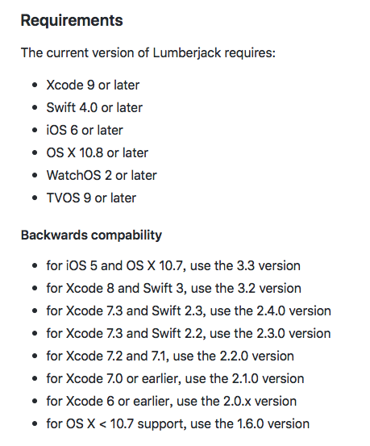
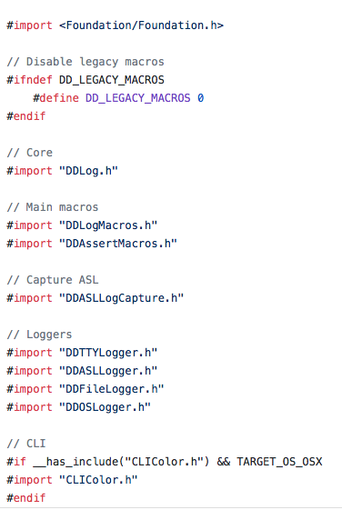
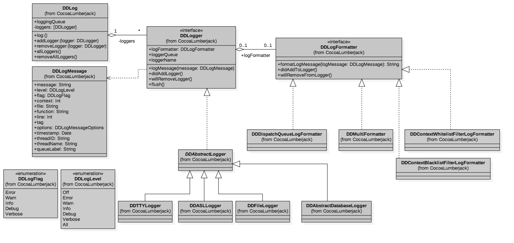
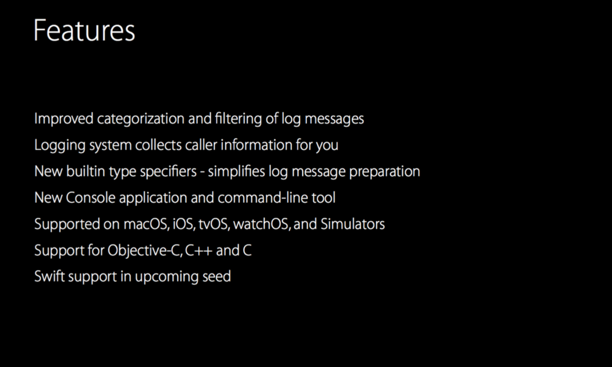

### 引入

在iOS开发中，日志系统是很重要的一个部分，尤其是在修复代码中的bug，通常会用NSLog来将这些信息打印到XCode控制台中显示，但在日志信息较多的时候，会出现一些性能上的[问题](http://blog.sunnyxx.com/2014/04/22/objc_dig_nslog/)。因为NSLog在使用的时候占用资源较多，其设计也是基于ASL(Apple System Log)的高层封装，针对error log。所以在对性能要求较高的地方，不能用NSLog进行调试。

作为NSLog的替代，CocoaLumberjack是一款优秀的第三方日志系统。官方的介绍如下：

```
CocoaLumberjack is a fast & simple, yet powerful & flexible logging framework
for Mac and iOS.

It is similar in concept to other popular logging frameworks such as log4j, yet
is designed specifically for Objective-C, and takes advantage of features such
as multi-threading, grand central dispatch (if available), lockless atomic
operations, and the dynamic nature of the Objective-C runtime.
```

支持用CocoaPods和Carthage部署到项目中，当前的系统要求如下：



在设计中，CocoaLumberjack使用了大量的GCD语法，使性能更好；宏定义的使用，让API接口语法更加简便；加上整体架构的设计独特，使这套第三方日志系统更利于根据一些特殊需求来定制功能。

### 代码分析

使用CocoaLumberjack的时候，会引用其头文件，Oc的项目引用CocoaLumberjack.h，swift项目CocoaLumberjack.swift。

这里，我们从CocoaLumberjack.h展开，文件开头给出了大段的注释信息，详细介绍了关于该日志系统的使用(在该源码的其他头文件中，同样可以看到消息的注释信息，对该接口甚至类的设计进行解说，可见一套优秀的开源项目在细节上是做的多么细致，值得学习！)，随后，引入了一系列的头文件：



`DDLog`是该日志系统中核心的部分，接口调用都通过该类进行调用，在该类中封装了许多的协议和基础类，也算是作为整个日志系统的执行中枢，给整套架构打下基础。

`DDLogMacros.h`和`DDAssertMacros.h`这两个文件中定义了大量的宏，都是对`DDLog`的接口进行的封装，封装后，对`DDLog`的使用变得更加简单。

`DDASLLogCapture`是用来捕获ASL消息的工具类。

`DDTTYLogger`、`DDASLLogger`、`DDFileLogger`和`DDOSLogger`是提供具体日志功能的类，分别对应着控制台日志功能、ASL日志功能、文件日志功能和oslog日志功能。如果需要增加新的日志功能，可以模仿这几个类，实现新功能。

### DDLog类

是单例，其内部维持了一个`dispatch_queue_t`、`dispatch_group_t`和信号锁`dispatch_semaphore_t`(最大为1000个线程同时访问),通过这类GCD属性可以很好地发挥出多线程的优势。此外在该类中还维持着一个loggers数组，数组里面的每个元素为`DDLoggerNode`类型的元素。`DDLog`用`DDLoggerNode`来保存被添加的logger(同之前介绍的logger)，并将添加logger时的`level`和logger中维持的线程也一并添加到`DDLoggerNode`里。这样当`DDLog`需要log一条message的时候，就会去遍历这个数组，然后根据`level`在相应的`dispatch_queue_t`中执行。

再`DDLog`中，定义了创建logger需要的一些接口和基础类，`DDLogger`和`DDLogFormatter`是两个协议，`DDLogger`是创建的logger必须遵循的协议，内部的定义如下：


- (void)logMessage:(DDLogMessage *)logMessage NS_SWIFT_NAME(log(message:));

@property (nonatomic, strong) id <DDLogFormatter> logFormatter;

@optional

- (void)didAddLogger;

- (void)didAddLoggerInQueue:(dispatch_queue_t)queue;

- (void)willRemoveLogger;

- (void)flush;

@property (nonatomic, DISPATCH_QUEUE_REFERENCE_TYPE, readonly) dispatch_queue_t loggerQueue;

@property (nonatomic, readonly) NSString *loggerName;


其中`logMessage`是用来被调用执行log的接口，在`DDLog`中被调用;`logFormatter`是一个遵循`DDLogFormatter`协议的类，主要用来控制log的格式(控制台输出或者存入文件);接下来的did和will开头的接口为事件响应，可以选择去实现在相应事件发生时候的处理；`flush`是在一些关系内存和io操作需要实现的类，它可以控制在内存不足的时候将buffer存入磁盘或者相关的数据库；最后`loggerQueue`和`loggerName`用来获取在logger中维持的线程队列，`loggerName`是用来创建队列用的名字，在`DDAbstractLogger`中可以看到logger线程队列是如何维持的。

在创建logger的时候，只需继承于`DDAbstractLogger`，其内部会维持一个CDG队列，然后遵循`DDLogger`协议，接口都在协议里面定义好了。在logger里面只需专注于功能的实现，这样可以省去很多接口定义和属性维持方面的事。

同样在`DDLog`里面会出现很多类似 `id<DDLogger>` 的属性，通过协议，即使不知道其具体实现，也可以调用接口。通过`DDAbstractLogger`基类和`DDLogger`协议，为拓展做了很好的基础。

CocoaLumberjack的架构关系如下图：



### 对比实验

苹果官方在2016年的WWDC上放出了新的日志系统([The unified logging system](https://developer.apple.com/documentation/os/logging?language=objc))，提供了日志信息分类统计和关键信息捕捉等功能，而且在速度上会更快、使用更方便、提供给开发者的可控性也更多。



这里对`NSLog`、`printf`、`os_log`和`writev`在命令行的输出性能进行了对比：


	CFAbsoluteTime startNSLog = CFAbsoluteTimeGetCurrent();
    for (int i = 0; i < 10000; i++) {
        NSLog(@"%d", i);
    }
    CFAbsoluteTime endNSLog = CFAbsoluteTimeGetCurrent();

    CFAbsoluteTime startPrintf = CFAbsoluteTimeGetCurrent();
    for (int i = 0; i < 10000; i++) {
        printf("%d\n", i);
    }
    CFAbsoluteTime endPrintf = CFAbsoluteTimeGetCurrent();

    CFAbsoluteTime startOsLog = CFAbsoluteTimeGetCurrent();
    for (int i = 0; i < 10000; i++) {
        os_log(OS_LOG_DEFAULT, "%d\n", i);
    }
    CFAbsoluteTime endOsLog = CFAbsoluteTimeGetCurrent();

    CFAbsoluteTime startWritev = CFAbsoluteTimeGetCurrent();
    for (int i = 0; i < 10000; i++) {
        struct iovec v[1];
        v[0].iov_base = "a\n";
        v[0].iov_len = 2;
        writev(STDERR_FILENO, v, 1);
    }
    CFAbsoluteTime endWritev = CFAbsoluteTimeGetCurrent();

    NSLog(@"NSLog time: %lf, printf time: %lf", endNSLog - startNSLog, endPrintf - startPrintf);
    NSLog(@"OsLog time: %lf, writev time: %lf", endOsLog - startOsLog, endWritev - startWritev);


Mac电脑上的运行时间：


虚拟机运行时间：


真机运行时间：


通过对比可知，采用writev和printf这种底层的命令行输出效率最高。

### 总结：

  1. CocoaLumberjack架构设计精妙，接口易于拓展定制功能。
  2. 苹果提供了新的日志系统API，但在命令行的输出上底层接口的效率更高。

参考：
[NSLog效率低下的原因及尝试lldb断点打印Log](http://blog.sunnyxx.com/2014/04/22/objc_dig_nslog/)

[WWDC2016 session721]( [https://developer.apple.com/videos/play/wwdc2016/721/](https://developer.apple.com/videos/play/wwdc2016/721/)
)

[Logging](https://developer.apple.com/documentation/os/logging?language=objc)
