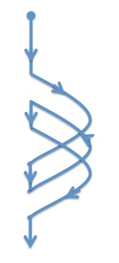
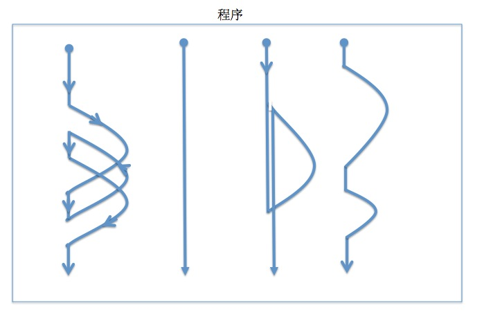
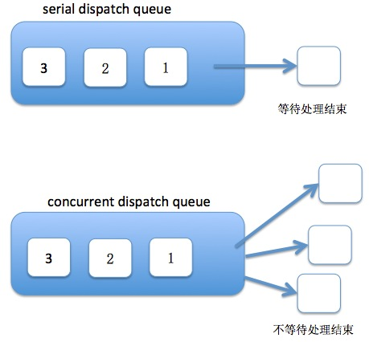

### 引入

GCD(Grand Central Dispatch)是苹果从OS X Snow Leopard 和 iOS4 开始引入的一套多线程开发的API，它是基于C语言的实现，其执行效率对比其他的多线程实现方式更高。其接口的调用很简洁，使用起来十分方便。用苹果爸爸的话来说，那就是：

```开发者要做的只是定义想执行的任务并追加到适当的Dispatch Queue```

既然有这么好的东西在这里，为什么不好好地去使用它呢？

### 梳理点

1. 多线程把原本顺序执行的程序变成了多个流程来执行，各个流程之间的切换会有性能消耗，但在GCD的时候，永远不用关注这些底层的事情。




2. 苹果爸爸说的那句话是追加，并不是执行，所以在需要考虑执行效率的地方使用GCD接口，一定要记住是追加，追加后并不一定是立刻就执行！！！

3. 在iOS6以后的版本，不用考虑`dispatch_release()`和`dispatch_retain()`的调用时机，系统以及将其交给ARC来处理。

4. Dispatch Queue分为两类，串行队列和并行队列，都是按照追加顺序执行，但一个串行队列总在一个线程中执行，会有等待，并行队列会发起多线程并发执行，没有等待。



5. Dispatch Queue可以通过`dispatch_queue_create`来创建，也可以从系统中来获取，系统提供了两类队列：Main Dispatch Queue 和 Global Dispatch Queue,其中Main Dispatch Queue是串行队列，Global Dispatch Queue是并行队列，同时提供四个执行等级。

6. 创建多个串行队列来操作同一个资源，会有数据竞争问题，用一个并行队列来操作，不会造成多线程安全问题，并且多个并行队列也不会。

7. `dispatch_sync`指定一个串行队列，会造成死锁。

8. `dispatch_apply`会有阻塞线程问题，必须规定次数的block执行完，才走之后的代码。

9. `dispatch_walltime`可用来创建绝对时间`dispatch_time_t`，相比`dispatch_time`创建的相对时间，绝对时间可用来做定时器。`dispatch_time_t`可用于`dispatch_delay` 和 `dispatch_group_wait`函数。


dispatch_time_t getDispatchTimeByDate(NSDate *date)
{
    NSTimeInterval interval;
    double second, subsecond;
    struct timespec time;
    dispatch_time_t milestone;

    interval = [date timeIntervalSince1970];
    subsecond = modf(interval, &second);
    time.tv_sec = second;
    time.tv_nsec = subsecond * NSEC_PER_SEC;
    milestone = dispatch_walltime(&time, 0);

    return milestone;
}



### Some Special Ways

1. 使用`dispatch_once`来执行只需运行一次的线程安全代码

2. 不要使用`dispatch_get_current_queue`，然而已经废弃了，所以就别用了

3. 可以用Dispatch Queue取代同步锁，这样可以提高效率

4. 少用`performSelect`，很多借口都可以通过GCD实现

NSOperationQueue是GCD的高层封装，提供了和GCD相同的功能，虽然在性能上不如GCD，但在一些功能的实现上使用NSOperationQueue会更加简便，在使用的时候可以仔细斟酌二者的区别，来觉得采用那种API。

使用NSOperationQueue的优点：

1. 可以取消某个NSOperation，但必须在其启动之前，通过这只标志位的方式，GCD则不能对单独的一个block取消。

2. 可以指定依赖关系，使一个操作必须依赖于其他操作。

3. 可以给NSOperation设置KVO监听，检查每个NSOperation的执行状态。

4. 可以指定每个NSOperation的优先级，NSOperationQueue的优先级也可以指定；GCD只有队列的优先级可以改变，而且是通过指定到系统的队列的方式。

5. 可以创建NSOperation的子类，定制一些功能。


### 参考资料：

[Objective-C高级编程](https://book.douban.com/subject/24720270/)

[Effective Objective-C 2.0](https://book.douban.com/subject/25829244/)

[Apple Developer Document](https://developer.apple.com/documentation/dispatch?language=objc)

[[iOS 多线程编程gcd全面系统认识](http://blog.csdn.net/hherima/article/details/38843965)
](http://blog.csdn.net/hherima/article/details/38843965)

