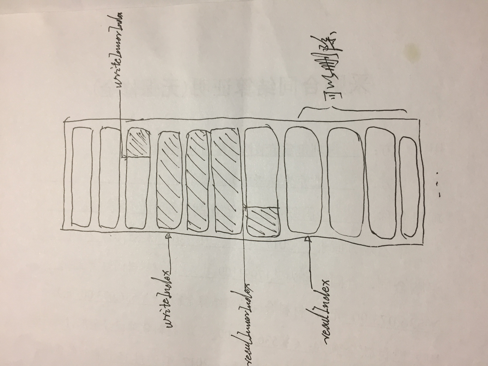

在实际的开发中，常常会遇到这种场景，一个模块产生数据，另外一个模块处理数据。无论是为了模块间的解耦或者是并发处理，我们都会在生成和处理数据的模块之间放置缓存区，作为生成与处理之间的数据仓库。这类模型就是生产者与消费者模型。

生产者和消费者往往是并发的多个线程，它们可能同时对一块数据进行增加与删除操作。一个比较常见的情形是在对网络数据的处理上，我们想把从网络下载的数据进行一个高效的处理，又不想保存在本地磁盘上。这个时候就会考虑用一个内存变量对数据进行缓存，同时需要满足以下这些条件：

  1. 线程安全，不能让一个线程正在对数据进行操作的时候，被其他线程打断。
  2. 在数据被处理完后，变量要及时被释放，减少内存占用。
  3. 写入操作快于读出操作时，要限制一个最大的变量空间并阻塞写入线程，等待读出操作，防止内存占用过大，将app杀死。
  4. 读出操作快于写入操作时，要在数据为空时，阻塞读出线程，等待写入线程的数据写入。

根据这些要点，本文设计了一种高效的数据仓库，该数据仓库可以对二进制数据进行线程安全的读写操作，读出数据后，立马释放读出的资源，内存占用少，没有磁盘操作，所以效率会很高。

[仓库链接](https://github.com/AirChen/NetworkStream)

该数据仓库的主体以一个可变数组组成，数组中的每个元素为一定长的二进制数据NSData，通过读标志位和写标志位，记录该结构体类数据的读写状态，当数据被读出，且正好凑出整数个NSData，则将这些NSData的内存进行释放，更新读写标志位。

{:width="70%" height="70%" align="center"}

这里起关键性作用的是记录读写状态的读写标志位，它们分为readIndex、readInnerIndex、writeIndex和writeInnerIndex，刚开始数据仓库中没有数据时，各个状态为赋值为-1。当开始写入数据，该数据结构会根据写入数据的长度计算出一个结束的位置，然后在结束为与当前的writeIndex和writeInnerIndex之间，写入数据。最后用结束位更新写标志位。

读操作与写操作类似，会先根据读长度来计算出一个读出结束标志位，然后把当前读标志位到读出结束标志位之间的数据写入一个读出的buffer，凑齐整数个NSData则删除，最后用读出结束标志位来更新度标志位，同时更具数组中删除的NSData个数，调整读写标志位中的XXIndex标志位。

同步锁使用的@synchronized，在数据读完后，有加等待，让数据继续写入，直到写入线程结束。
