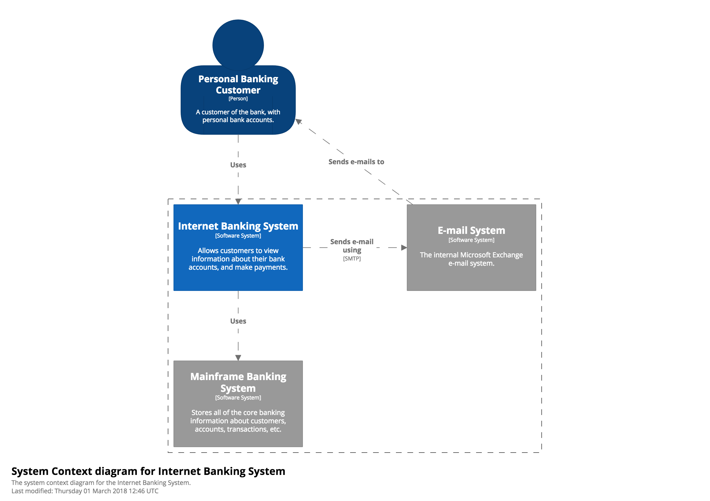
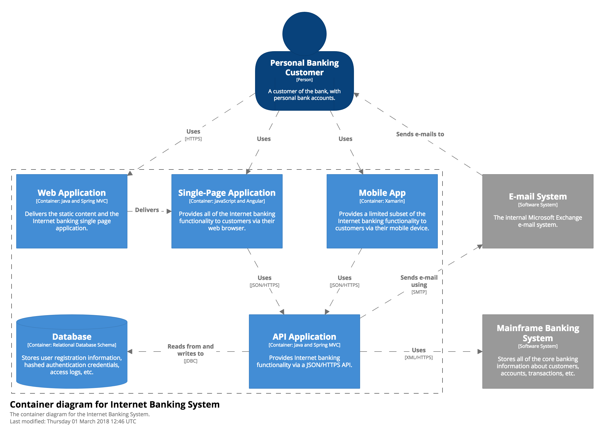
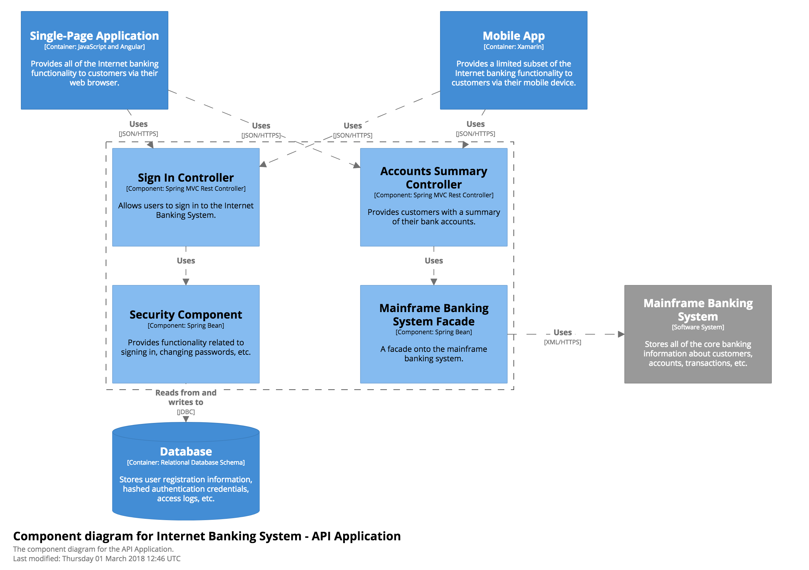
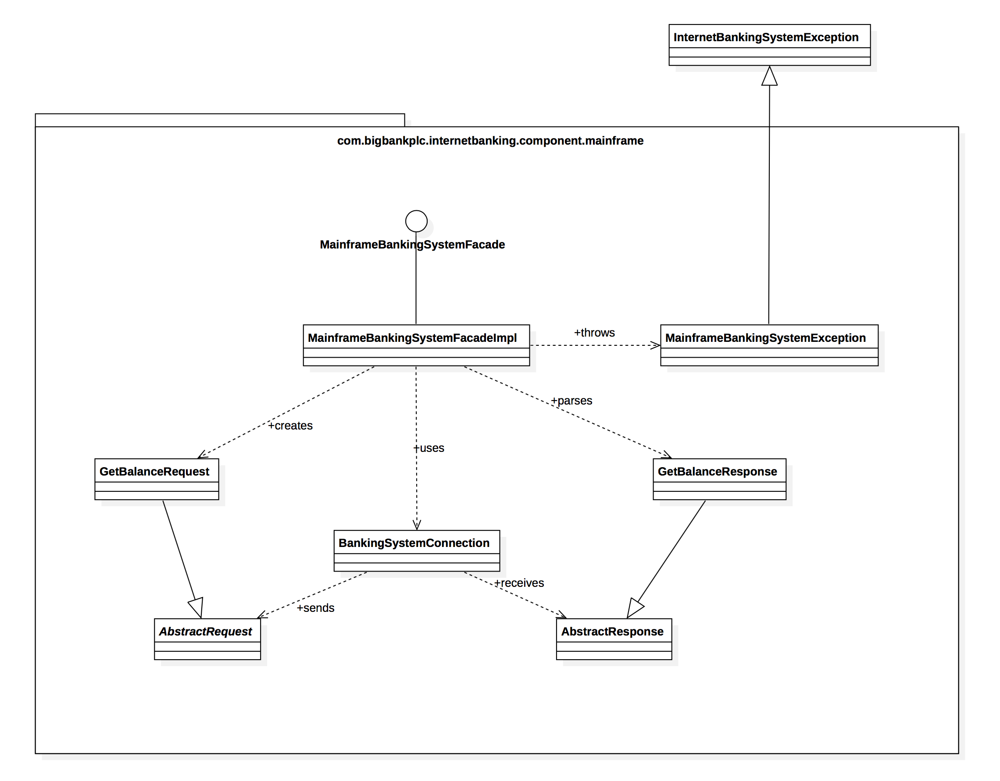

近期在工作之余阅读了一本架构方面的书籍，《软件架构》，由国际知名架构师Simon Brown编写，国内邓刚翻译。全书200多页，分为了68个章节，8个部分，每个章节一到两页，全书阅读下来并不会花太多时间。相比较一些软件架构方面的大厚本，此书比较适合作为一部架构方面的入门书籍，阅读完此书，可以对架构师这个职业角色有个清晰的认识。

全书的第四部分，介绍了关于软件可视化的一些方案，感觉非常实用。在日常的项目开发过程中，会面临团队合作，部门间合作等问题，不同个体之间的合作，自然避免不了要做技术上的沟通。在缺少文档的时候，一副可以提现各个模块之间联系的架构图可以很好地提现项目整体逻辑，提高技术沟通的有效性。书中有介绍一种C4的模型，具有很强的表达性和制作简洁等优势，本文将详细介绍这个模型。

C4模型将软件系统分成：系统、容器、组件和类。系统即软件系统，一般需给出其具体的使用环境和需要解决的需求，在其之下会有一系列的容器；容器是一个个单独的可执行文件，负责其固定的功能，在每个单独的容器会有一系列的组件来构成该容器；组件是应用程序中的功能模块，每个组件负责各自单独的功能，最后为了实现该组件的特定功能，会有一系列的类来实现这个组件。总体的结构示意图如下：

根据场景的不同，可以将C4模型中的四个部分对应为：语境图（Context）、容器图（Container）、组件图（Component）和类图（Code），这也是C4模型名字的由来。

### 语境图
系统语境图是绘制一个软件系统的开始。在一个方框的中间画出系统，系统周围画出一些与之交互的使用者和其他功能系统。

在语境图中，不必详细的展示每个细节，需要更加关注于人和软件系统的关系，而不是技术细节和实现原理。语境图应该是一种可以展示给非技术人员看的图。

范围：一整个软件系统

关键元素：范围内的软件系统
辅助元素：范围内的人和软件系统之间的联系

受众：每个人，包括技术和非技术人员，软件开发团队内的人和团队外的人

### 容器图
一旦你理解软件系统适用的IT环境，真正有益的下一步是关注于系统周边的容器图。一个容器可以是一个：服务器端的web应用、单页面的应用程序、桌面应用程序、移动端APP、数据库方案、文件系统等等。基本特征是，容器是一个独立的可运行程序或者可部署单元。

容器图展示的软件的高层次组织结构，同时也展示了主要技术的选择和容器之间的交互。这是一种简单的高层技术选型的图，但对软件开发人员很有用。

范围：单独的软件系统

主要元素：软件系统内的各个容器
辅助元素：和容器相关的人和软件系统之间的联系

受众：软件系统开发团队相关的技术人员，包括了：架构师、开发者和技术支持人员

注意：该图不需要介绍部署场景、集群、复制和故障转移等等

### 组件图

组件图展示的是一个容器内部是如何组织各个组件的，一个组件即容器内部的一个功能和技术实现细节。

范围：单个容器

主要元素：容器范围内的各个组件
辅助元素：容器、和组件相关的人和软件系统的联系

受众：架构师和开发者

### 类图

类图是单个组件的实现代码组织，可以用类似UML图、整体关系图来表示。

这是一种可选的图，通常情况下可以用IDE和UML模型工具自动生成，你应该思考的是需要暴露类的那些属性和接口来表示这个组件的功能。类图不推荐制作，除非组件的功能逻辑相当复杂。

范围：单个组件

主要元素：组件范围内的代码元素，如：类、接口、对象、函数、基础表格等等。

受众：架构师和开发者

### 总结
C4模型主要通过“抽象first”的方式来绘制架构图，通过基于上层的抽象反应出软件系统的结构，同时也体现了开发者对于软件系统的思考，这种基于子集的抽象和分层的方式使C4模型非常容易学习和使用。

在软件项目需要与拟出一份技术文稿的时候，可以先试试将软件系统绘制成一个个架构图，来梳理其结构。

### 参考资料
[C4模型官网](https://c4model.com/)

[程序员必读之软件架构](http://item.jd.com/11586611.html)
