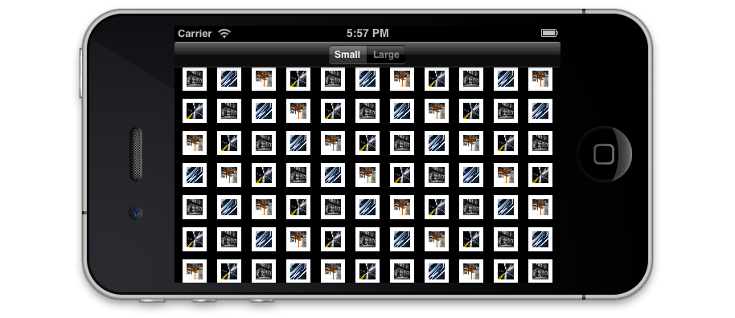
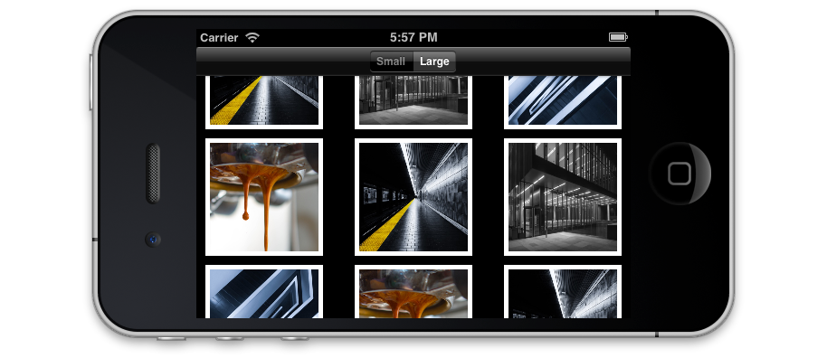
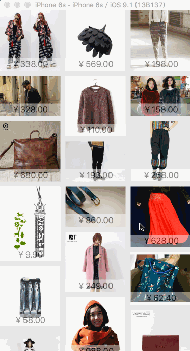
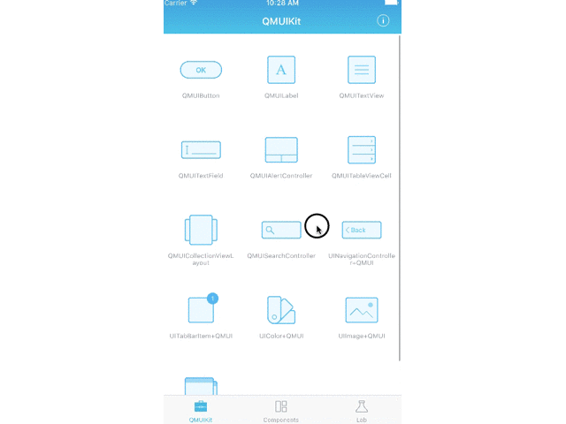

子类化UICollectionViewFlowLayout可以让UICollectionView实现许多精彩的布局，在实际的项目中子类化UICollectionViewFlowLayout得到了广泛的应用。
### 引入

以下是一些实例：








可见借助于UICollectionViewFlowLayout可以让UICollectionView展示丰富的界面效果。

### 基本用法

涉及到的类有：

```
     UICollectionViewFlowLayout => 负责item的布局，也可实现切换item的动画
     UICollectionView => 展示的总视图
     UICollectionViewCell => 每个item
```

协议有：

```
    UICollectionViewDelegate
    UICollectionViewDataSource
```

用已经子类化的UICollectionViewFlowLayout创建一个UICollectionView

```
    self.collectionView = [[UICollectionView alloc] initWithFrame:CGRectZero collectionViewLayout:self.smallLayout];
```

在数据源方法中实现item的数量与每个item的创建

```
    - (NSInteger)collectionView:(UICollectionView *)collectionView numberOfItemsInSection:(NSInteger)section;

    - (__kindof UICollectionViewCell *)collectionView:(UICollectionView *)collectionView cellForItemAtIndexPath:(NSIndexPath *)indexPath;
```

其中UICollectionViewCell可以子类化，添加一些label或者ImageView。

可以简单的子类化一个UICollectionViewFlowLayout，只需复写以下init方法：

```
    -(id)init
    {
        if (!(self = [super init])) return nil;
        self.itemSize = CGSizeMake(30, 30);
        self.sectionInset = UIEdgeInsetsMake(10, 10, 10, 10);
        self.minimumInteritemSpacing = 10.0f;
        self.minimumLineSpacing = 10.0f;
        return self;
    }
```

此外UICollectionViewFlowLayout还包括一些其他的方法，可以根据需求来选择：

```
    -(CGSize)collectionViewContentSize
    //返回contentsize的总大小
    -(BOOL)shouldInvalidateLayoutForBoundsChange:(CGRect)newBounds
    //自定义布局必须YES
    - (UICollectionViewLayoutAttributes *)layoutAttributesForItemAtIndexPath:(NSIndexPath *)path{}//返回每个cell的布局属性
    -(NSArray*)layoutAttributesForElementsInRect:(CGRect)rect
    //返回所有cell的布局属性
```

[参考实例](https://github.com/ashfurrow/UICollectionViewFlowLayoutExample)

### 瀑布流

与基础部分的使用基本一致，UICollectionViewFlowLayout的子类设计思路如下：
每个item对应一个UICollectionViewLayoutAttributes属性，这里要注意该属性中的frame，它负责每个item的布局，瀑布流的布局是便利一个数据源数组，数组中有每个item的长宽，从最上层开始，往下进行布局。设置两个状态量，分别保存每列的累加长度和item个数，将从数组中遍历到的item数据的高度加到最短的列中。

用到了两个关键的方法：

```
    - (void)prepareLayout;
    - (NSArray *)layoutAttributesForElementsInRect:(CGRect)rect;
```

关键代码：

```
    // 遍历 goodsList 数组计算相关的属性
    NSInteger index = 0;
    NSMutableArray *attributesArray = [NSMutableArray arrayWithCapacity:self.goodsList.count];
    for (LNGood *good in self.goodsList) {

        // 建立布局属性
        NSIndexPath *indexPath = [NSIndexPath indexPathForItem:index inSection:0];
        UICollectionViewLayoutAttributes *attributes = [UICollectionViewLayoutAttributes layoutAttributesForCellWithIndexPath:indexPath];
        // 找出最短列号
        NSInteger column = [self shortestColumn:columnHeight];
        // 数据追加在最短列
        columnItemCount[column]++;
        // X值
        CGFloat itemX = (itemWidth + self.minimumInteritemSpacing) * column + self.sectionInset.left;
        // Y值
        CGFloat itemY = columnHeight[column];
        // 等比例缩放 计算item的高度
        CGFloat itemH = good.h * itemWidth / good.w;
        // 设置frame
        attributes.frame = CGRectMake(itemX, itemY, itemWidth, itemH);
        [attributesArray addObject:attributes];

        // 累加列高
        columnHeight[column] += itemH + self.minimumLineSpacing;

        index++;
    }
```

[视图内容的高度固定](https://github.com/zhouande/TLCollectionWaterfallFlow)

[视图内容高度无限，向下刷新](https://github.com/lengmolehongyan/WaterfallFlowDemo)

### 动画效果

UICollectionViewLayoutAttributes的frame属性负责item的布局，transform3D属性可以做动画效果

```
    if (self.style == QMUICollectionViewPagingLayoutStyleScale) {

        CGFloat distanceForMinimumScale = itemSize.width + self.minimumLineSpacing;
        CGFloat distanceForMaximumScale = 0.0;

        for (UICollectionViewLayoutAttributes *attributes in resultAttributes) {
            CGFloat scale = 0;
            CGFloat distance = fabs(offset - attributes.center.x);
            if (distance >= distanceForMinimumScale) {
                scale = self.minimumScale;
            } else if (distance == distanceForMaximumScale) {
                scale = self.maximumScale;
            } else {
                scale = self.minimumScale + (distanceForMinimumScale - distance) * (self.maximumScale - self.minimumScale) / (distanceForMinimumScale - distanceForMaximumScale);
            }
            attributes.transform3D = CATransform3DMakeScale(scale, scale, 1);
            attributes.zIndex = 1;
        }
        return resultAttributes;
    }
```

其中offset为当前滚动位置的可视区域的中心点。

[QMUI 的 QMUICollectionViewPagingLayout支持旋转和放大效果](https://github.com/QMUI/QMUIDemo_iOS/blob/master/QMUI/QMUIKit/UIKitExtensions/QMUICollectionViewPagingLayout.m)
