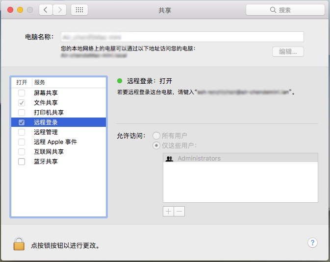

### 安装

Homebrew是MacOs系统下一款强大的软件包管理工具，通过它可以安装git、wget等工具，同样Hadoop的安装也可以通过它来进行：

```
brew install hadoop
```
这样hadoop被安装在系统的 /usr/local/Cellar/hadoop 目录之下。

### 配置

hadoop安装后，提供三种运行模式：
###### 独立模式
###### 伪分布模式
###### 完全分布式
以下是《Hadoop权威指南》对这三种模式的解释：

```
Standalone (or local) mode
There are no daemons running and everything runs in a single JVM. Standalone
mode is suitable for running MapReduce programs during development, since it is
easy to test and debug them.

Pseudodistributed mode
The Hadoop daemons run on the local machine, thus simulating a cluster on a small
scale.

Fully distributed mode
The Hadoop daemons run on a cluster of machines.
```
在用brew安装完成后，Hadoop默认是独立模式，这种模式没有开辟守护进程，运行与JVM虚拟机上，适合MapReduce的测试与调试。而伪分布式模式会开辟守护进程，运行效果和在集群上类似，所以这里，我们将在电脑上进行伪分布模式的配置。

#### 1.配置文件

在目录/usr/local/Cellar/hadoop/xxxxx/libexec/etc/hadoop/下进行配置：

```
<?xml version="1.0"?>
<!-- core-site.xml -->
<configuration>
<property>
<name>fs.defaultFS</name>
<value>hdfs://localhost/</value>
</property>
</configuration>

<?xml version="1.0"?>
<!-- hdfs-site.xml -->
<configuration>
<property>
<name>dfs.replication</name>
<value>1</value>
</property>
</configuration>

<?xml version="1.0"?>
<!-- mapred-site.xml -->
<configuration>
<property>
<name>mapreduce.framework.name</name>
<value>yarn</value>
</property>
</configuration>

<?xml version="1.0"?>
<!-- yarn-site.xml -->
<configuration>
<property>
<name>yarn.resourcemanager.hostname</name>
<value>localhost</value>
</property>
<property>
<name>yarn.nodemanager.aux-services</name>
<value>mapreduce_shuffle</value>
</property>
</configuration>
```
需要对core-site.xml、hdfs-site.xml、mapred-site.xml、yarn-site.xml四个文件添加这些键值对。（可以将该文件夹复制多份，开启Hadoop时调用不同的文件下从而可以开启不同的模式）

#### 2.ssh登陆配置

在伪分布模式下，Hadoop是需要通过ssh来登陆的，如果配置了ssh秘钥，登陆就不需要做密码输入。先查看本地目录~/.ssh/下是否存在id_rsa和id_rsa.pub文件，如果没有的话，可以通过：

```
ssh-keygen -t rsa
```
进行生成。如果没有~/.ssh/文件夹，需要先手动创立一下，然后在此文件夹下操作。
为了让系统接受登陆，需要将共钥传入authorized_keys文件：

```
cat id_rsa.pub >> authorized_keys
```
最后，在MacOs下，需要在设置里面打开远程登录权限，进入系统偏好设置 >> 共享 >> 远程登录。将其设置为开启就可以了。




通过命令行运行：

```
ssh localhost

exit
```
查看能够登录成功。

#### 3.格式化namenode节点

配置的最后一步是格式化namenode节点，在命令行运行：

```
hdfs namenode -format
```
该操作会对系统临时文件夹下的目录进行操作，不会对硬盘产生格式化。

### 启动与关闭Hadoop

进入 /usr/local/Cellar/hadoop/xxxxxx/sbin/ 目录
启动调用以下脚本：

```
% start-dfs.sh
% start-yarn.sh
% mr-jobhistory-daemon.sh start historyserver
```

关闭调用以下脚本：

```
% mr-jobhistory-daemon.sh stop historyserver
% stop-yarn.sh
% stop-dfs.sh
```
程序默认的是调用hadoop配置文件夹下的配置文件，当我们做了多个配置文件夹，可以这样启动其他的配置模式。

```
% start-dfs.sh --config path-to-config-directory
% start-yarn.sh --config path-to-config-directory
% mr-jobhistory-daemon.sh --config path-to-config-directory start historyserver
```

### 状态查看

Hadoop的运行状态怎样？光启动和关闭看不出什么状况，甚至都不知道有没有启动成功。这里有两种方式可以验证Hadoop的运行状况。

#### 1.命令行jps

在命令行输入jps，可以查看到java进程的，当没有启动Hadoop时，只看得到jps一个进程。如果启动成功会多出许多进程，同样，关闭后这些进程就没有了。

#### 2.网页

在浏览器打开如下链接可以进入不同的管理界面：

```
Resource Manager: http://localhost:50070
JobTracker: http://localhost:8088
Specific Node Information: http://localhost:8042
```

[参考文献](https://amodernstory.com/2014/09/23/installing-hadoop-on-mac-osx-yosemite/)
