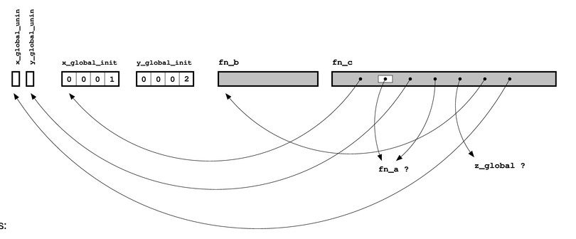
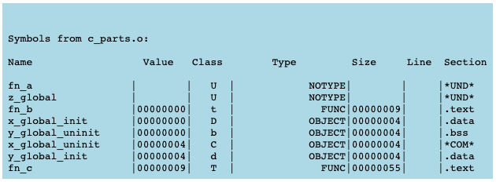
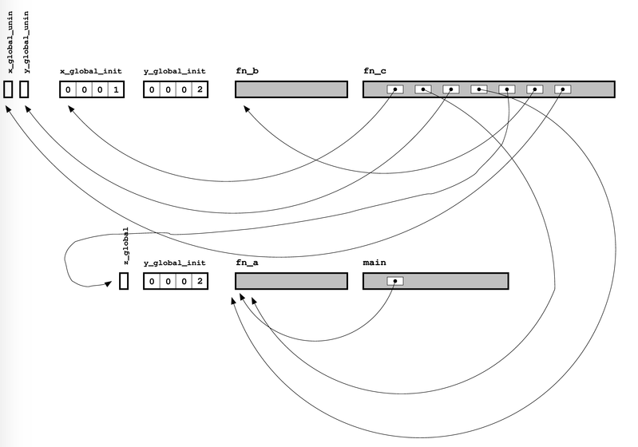
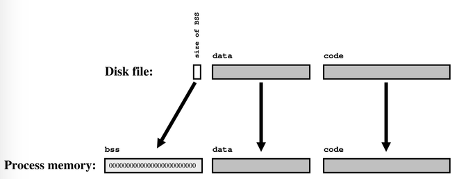
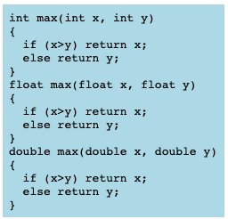
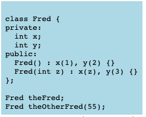

### 命名：C源文件中都有什么？

这部分是介绍 C源文件的组成，如果你熟悉下列代码，可以进入下一小结。

第一步需要区分 申明(declarations) 和 定义(definitions),
 定义关联一个名字并且有代码或者数据来实现这个名字：

	1. 定义一个变量，让编译器给该变量分配空间，可能给这个空间分配一个值。
	2. 定义一个函数，让编译器给这个函数产生代码。

 声明告诉 C 编译器在当前程序中有这个定义，可能在别的 C源文件中。（注意：定义有时会看成声明，当其位置在声明的地方时）。

 接下来是对于变量，有两种类型定义：

 	1. 全部变量，存在于整个程序的生命周期中("static extent")，在很多不同的函数中可以获取到。
 	2. 局部变量，仅存在于一个特定的函数中("local extent")，仅通过这个函数才能获取到这个变量。
 	(这里的获取，是说可以引用这个变量)

这里有两个特例：

    1. 静态局部变量，实际上是全局变量，因为它存在于整个生命周期，但只能从这个特定函数获取。
    2. 同样的静态全局变量也可以看成全局变量，虽然只能在它定义的 C文件中获取到。

这里我们把焦点放在了关键字 "静态(static)" 上，需要指出的是将一个函数变为静态函数，可以减少其他地方引用该函数的行数(特别是通过同一个 C文件的不同函数) -> 此处我的理解是函数的定义代码被共享了，不会在引用的地方再展开函数。

对于全局变量和局部变量定义，我们还可以区分变量是否初始化(也就是说，与特定名称关联的空间是否预先填充了特定值)。 

最后，我们可以通过 malloc 或者 new 把信息动态地存储到内存，没有办法通过名称直接访问分配的内存，所以我们必须通过指针(一个命名变量保留着一段内存地址)。这个内存地址可以通过 free 或者 delete 来销毁，所以这被引用的空间有个动态的范围(dynamic extent)。

总结一下：


/* This is the definition of a uninitialized global variable */
int x_global_uninit;

/* This is the definition of a initialized global variable */
int x_global_init = 1;

/* This is the definition of a uninitialized global variable, albeit
 * one that can only be accessed by name in this C file */
static int y_global_uninit;

/* This is the definition of a initialized global variable, albeit
 * one that can only be accessed by name in this C file */
static int y_global_init = 2;

/* This is a declaration of a global variable that exists somewhere
 * else in the program */
extern int z_global;

/* This is a declaration of a function that exists somewhere else in
 * the program (you can add "extern" beforehand if you like, but it's
 * not needed) */
int fn_a(int x, int y);

/* This is a definition of a function, but because it is marked as
 * static, it can only be referred to by name in this C file alone */
static int fn_b(int x)
{
  return x+1;
}

/* This is a definition of a function. */
/* The function parameter counts as a local variable */
int fn_c(int x_local)
{
  /* This is the definition of an uninitialized local variable */
  int y_local_uninit;
  /* This is the definition of an initialized local variable */
  int y_local_init = 3;

  /* Code that refers to local and global variables and other
   * functions by name */
  x_global_uninit = fn_a(x_local, x_global_init);
  y_local_uninit = fn_a(x_local, y_local_init);
  y_local_uninit += fn_b(z_global);
  return (y_global_uninit + y_local_uninit);
}


### C 编译器做了什么？

C 编译器的任务是将人们可读的代码翻译为机器可理解的代码。编译器的输出为目标文件(Object file)。在 UNIX 平台这些目标文件通常以 .o 结尾，Windows 上以 .obj 结尾。目标文件的内容是最基础的两类东西：

	1. 代码 C 文件中响应的函数定义
	2. 数据 C 文件中全局变量的定义(对于初始化的全局变量，初始值已经保存在目标文件中了)

这两种类型的实例，都有名字与其关联(变量和函数的名字是在定义的时候产生的)。

目标文件代码是一系列的机器指令，和程序员写入的 C 指令相关联(if /while /goto)。所有这些指令都需要处理一些信息，这些信息需要保存在某个地方，这是变量的工作。该代码还可以引用其他代码位，尤其是程序中的其他C函数。

在任何地方，代码如果能够引用一个变量或者函数，编译器必须提前看到这个变量或者函数的声明(声明约定了定义存在于整个程序的某个地方)。

链接器的任务就是遵守这些约定，但编译器是怎样在生成目标文件的同时处理所有的约定的呢？

基本上，编译器会留下一个空白。空白(“引用”)有一个与之关联的名称，但是与该名称对应的值未知。

我们可以描述上个示例的引用关系如下：

### 剖析一个目标文件

到目前为止，我们都是在上层来分析的；看看在实际中底层如何工作这也很重要。这里用到的关键工具是 nm ,用它可以获取 NUIX 平台一个目标文件的标记(symbols)信息。Windows平台可以用 dumpbin 带上 /symbols 来大致产生相同的效果；这里也有提供了一个 Windows 版本的 [nm](https://sourceforge.net/projects/mingw/files/OldFiles/) 工具。

让我们看看通过 nm 工具获取到上面示例目标文件的信息：

不同平台下的输出会有一点点不同(查看 nm 的 pages 页可以查找出版本的特性)，但是给出的关键信息是每个符号(symbol)的类别(class)和大小(size)，class有不同的值：

1. "U" 是指未定义的引用，上文说的编译器留出的空缺是其中一种。在这个目标文件中，有两个 "U" 类型 "fn_a" 和 "z_global"。(一些 nm 版本可能会打印一个词语，如 "*UND*" 或者 "UNDEF")
2. "t" "T" 是指这个函数定义了，"t" 是说函数定义在同一个文件下，"T"是说函数定义在其他文件下(函数初始定义的地方是静态的"static")。(同样，一些系统下会显示为一个词语, 如 ".text")
3. "d" "D" 是指初始化的全局变量，同样 "d" 是定义在同一个文件下，"D"是定义在其他文件下("static")。( ".data")
4. "b" "B" "C" 是指未初始化的全局变量，静态的或者本文件中的是 "b", B 和 C 是其他的。(".bss" "*COM*")

我们可能获取到的一些 Symbols 不是 C源文件最初输入的一部分；我们将会忽略这些 Symbols，把它们视为编译器内部机制产生的试图获取我们程序的恶意链接。

### 连接器做了什么？(一)

我们在之前提过，声明一个函数或者变量就是给 C编译器一个约定，在程序的某个地方有这个函数或者变量的定义，链接器的作用就是达成这个约定。通过前面的目标文件图，我们可以进一步阐述填充空白的过程。

为了阐述填充空白，我们再增加一个 C文件：


/* Initialized global variable */
int z_global = 11;
/* Second global named y_global_init, but they are both static */
static int y_global_init = 2;
/* Declaration of another global variable */
extern int x_global_init;

int fn_a(int x, int y)
{
  return(x+y);
}

int main(int argc, char *argv[])
{
  const char *message = "Hello, world";

  return fn_a(11,12);
}


将这两幅图放一起，我们能够将所有的节点连接起来(如果存在连接不上的点，链接器会报错)。每个事物都有它自己的位置，每个位置都有它自己的事物，而链接器可以填充所有的空缺，如图所示：

我们可以通过 nm 指令来查看这两个目标文件链接后的信息：

所有的符号(Symbol)来自这两个目标文件，所有的未定义引用都没有了。这些也都进行了重新排序，以便将相似类型的事物放在一起，并添加了一些附加功能，以帮助操作系统将整个事物作为可执行程序处理。
(还有很多复杂的细节使输出杂乱无章，但是如果您滤除任何以下划线开头的内容，它将变得更加简单。)

### 重复的符号

上小结中有提到如果链接器找不到符号的定义，就会报错。但是如果在连接时有两个不同的定义对应一个符号呢？

在 C++ 中，这场景的处理很直接。这语言有严格的一个定义对应一个符号的规则，在连接时只能有一个定义与符号对应，不能多也不能少。(C ++标准的相关部分是3.2，其中还提到了一些例外情况，我们将在以后介绍。)

在 C 语言中，这个规则有些模糊。任何函数或者初始化的全局变量必须有明确的定义，但是未初始化的全局变量可以视为临时定义。C 语言允许(或者不禁止)不同的源文件有对一个符号的临时定义。

然而链接器除了处理 C 和 C++ 外还要处理其他语言，这些语言不一定适用一个定义对应一个符号的规则。例如：Fortran语言的普通模型是将全局变量拷贝到引用到它的每个文件中，链接器要求选择其中一个拷贝(如果他们大小不一，选择其中最大的)，将其他重复的折叠起来抛弃。(这个模型被称为链接器的共用模型，以 Fortran 的关键字 "COMMON" 命名)

因此，对于 UNIX 连接器来说，至少在重复符号是未初始化的全局变量时，通常它们不会抱怨符号的重复定义(这有时被说成是连接的“宽松声明/定义模型”)。如果你担心这个问题，查阅链接器的手册通常有 "--work-properly"选项来严格限制重复定义的行为。例如：GUN 工具链就有 "-fno-common" 选项将未初始化的变量放在 BBS 段(BBS segment) 而不是 Common 块(BBS block)。

### 操作系统做了什么？

现在链接器已经将所有的符号引用都连接到了对应的定义，生成了一个可执行程序，我们需要暂停一会儿来简明的说明一下在程序运行的时候，操作系统所扮演的角色。

运行程序显然涉及执行机器代码，所以操作系统必须将磁盘上的可执行文件翻译为机器代码送入CPU可读取的地方--计算机内存。程序被送入内存的部分被命名为代码段(code segment)或者文本段(text segment)。

没有数据的代码什么也不是，所以全部的全局变量也要被送入计算机内存。然而初始化和未被初始化的全局变量是有区别的。初始化的全局变量有初始值保存在之前的目标文件和可执行文件中。当程序执行起来，操作系统会将这些值拷贝到内存的数据段(data segment)。对于未被初始化的全局变量，操作系统假设它们的初始值为 0，没有必要拷贝任何值。这些初始化为0的内存块称为bss段(BBS segment)。

这意味着可以将空间保存在磁盘上的可执行文件中。 初始化变量的初始值必须存储在文件中，但是对于未初始化变量，我们只需要计算它们需要多少空间即可。

读者也许注意到，前面我们所讨论的目标文件和链接器只涉及到了全局变量，并没有讨论过局部变量和动态分配的内存(指针对象)。

其实这些数据的分配并不需要任何链接器的参与，因为它们的生命周期发生在程序的运行时(run time)，在链接器完成了它的工作之后。为了文章的完整性，在这里简单的介绍一下：

1. 局部变量被分配在栈内存上，栈内存随着函数的调用和完成，增长或者减小。
2. 动态分配的内存受到堆内存管理，malloc 函数在这个区域内搜索可用的空间。

我们把这部分内存分配加入到图中，完成在程序运行时刻的内存分配模型。因为堆和栈在程序运行时大小是会随时改变的，通常安排堆往一个方向扩展内存，栈往另外一个方向。通过这种方式，程序只会在这两端相遇时耗尽内存(此时，内存空间已经满了)

### 连接器做了什么？(二)

现在我们已经了解了链接器的基本原理，接下来可以讨论更复杂的细节 -- 大致按照这些特性在历史上被添加到链接器的顺序。

影响编译器功能的主要观察点是：如果有大量不同的程序需要处理同一类的事情(例如：输出到屏幕、从磁盘读入文件)，那么在一个地方通用该代码并让许多不同的程序使用它显然很有意义。

链接不同程序时只使用相同的目标文件是完全可行的，如果将相关目标文件的整个集合放在一个易于访问的地方(库 library)，则可以使工作变得更加轻松。

(技术说明:本节完全跳过了链接器的一个主要特性:重定位(relocation)。不同的程序由不同的大小，当共享库(shared library)映射到程序内存地址时，会被分配于不同的地址。也就是说这个库中的所有函数和变量会被分配在不同的地方。如果所有引用地址的方法都是相对的(“+1020bites”)，而不是绝对的(“0x102218BF”)，那么问题就不那么严重了。如果不是这样，所有的绝对地址需要加上一个合适的偏移，这就是重定位(relocation)。本文没有继续深入这个话题，因为 C/C++ 程序员很少会遇到这方面问题，大多数链接问题不会是因为重定位引起的。)

#### 静态库

库(library)最基本的形态是静态库(static library)。前章节提到过可以通过复用目标文件来共享代码，事实证明，静态库确实没有比这复杂得多。

在 UNIX 系统上，产生静态库的指令为 ar ，生成的静态库以 .a 作为扩展名。这些库文件命名通常以"lib"开头作为前缀，链接器在连接时会在名称上去掉前缀和扩展名，加上 "-l" 选项(例如："-lfred" 会链接"libfred.a"的库)。
(过去，一个程序需要调用 "ranlib" 程序来在库的开头建立符号索引(index of symbols)。现在 ar 工具可以完成这些工作。)

当链接器遍历要连接在一起的目标文件集合时，它会建立一个尚未解析的符号列表(unresolved list)。当完成所有明确指定的目标后，链接器现在可以在库中查找在未解析列表(unresolved list)上保留的符号。当未解析符号的定义在这个库的一个目标文件中是，这个目标文件被加载，就像用户首先在命令行上赋值了这个目标文件一样，然后链接继续。

请注意从库中提取的粒度：如果一些符号定义是需要的，包含这些符号定义目标文件都会被加载。这意味着该过程可以向前迈出，也可以向后迈一步 -- 新添加的目标可以解析一个未定义的引用，但是很可能会附带一整套新的未定义引用供链接器解析。

另外一个注意点是加载的顺序：库里的符号被链接只有在常用链接完成后才被开始，它们是按照顺序执行的，从左至右(在链接行中)。这意味着，如果从链接行(link line)后期的库中拉入的对象需要链接行中较早的库中的符号，则链接程序将不会自动找到它。

下面实例可以解释清除，假设我们有如下目标文件，和一个链接行拉入了 a.o、 b.o、 -lx 和 -ly。

一旦链接器处理了 a.o、 b.o，就能处理 b2、 a3 的引用，留下了未定义引用 x12 和 y22。这时，链接器检查第一个库 libx.a 中的定义，发现目标文件 x1.o 能满足未定义符号 x12 的引用，然而又新增了 x23 和 y12 到未解析引用表。 (现在这个列表成了 y22、 x23 和 y12)。

链接器仍然在处理 libx.a ，x23 的引用很容易实现，只许从 libx.a 拉入目标文件 x2.o 。然而，未解析引用表又新增了 y11 (现在列表成了 y22、y12、y11)。到目前为止，libx.a 中找不到未解析引用表中符号的定义了，所以链接器接下来开始检查 liby.a 。

链接器按照同样的方式处理 y1.o 和 y2.o 目标文件。第一个加入的未定义引用 y21 很快就在 y2.o 目标文件中找到了，这时所有未定义的引用都找到了，未解析引用表清空，库中的某些但不是全部目标文件已包含在最终可执行文件中。

注意当 b.o 目标文件中有一个未解析引用 y32 时，情况会有一点点不一样：链接 libx.a 的工作还是一样，但是在处理 liby.a 时，y3.o 目标文件会被拉入进来，同时未解析引用 x31 会被加入到未解析引用表中，链接会失败，因为 x31 的定义在 libx.a 的 x3.o 目标文件中，而 libx.a 已经被链接器处理完了。
(顺便说一句，此示例在两个库libx.a和liby.a之间具有循环依赖性，这是很糟糕的事情，特别是在 Windows 系统下)

#### 共享库(动态库)

对于诸如C标准库（通常为libc）之类的流行库，拥有静态库会存在一个明显的缺点 -- 每个可执行程序都具有相同代码的副本。 如果每个可执行文件都有一个 printf 和 fopen 之类的副本，这会占用很多不必要的磁盘空间。

不太明显的缺点是，程序一旦被静态链接了，其中的代码将永远固定。如果有人发现 printf 函数存在 bug ，所有的程序必须被重新编译链接一遍来修复代码。

为了解决这些问题和相关问题，引入了共享库(通常以 .so 扩展名表示，或者在 Windows 计算机上以 .dll 表示，在 Mac OS X 上以 .dylib 表示)。对于这些类型的库，普通的命令行链接器不一定会连接所有的点。而是，采用一种“ IOU”便笺，并将该便笺的付款推迟到程序实际运行的那一刻。

归结为：如果链接器发现特定符号的定义在共享库中，则它在最终可执行文件中不包含该符号的定义。而是，链接器在可执行文件中记录符号的名称以及它应来自哪个库。

当程序运行时，操作系统安排这些剩余的链接位“及时”完成，以使程序运行。 在运行主函数(main)之前，较小版本的链接器（通常称为ld.so）会处理链接器之前添加的便签，并在那里进行链接的最后阶段 -- 拉入库中的代码并连接所有点。

这意味着所有可执行文件都没有 printf 函数的代码副本。 如果有新的，固定的 printf 版本可用，只需更改 libc.so 就可以使用它，下次任何程序运行时，它将被提取。

静态库和共享库另外一个大的区别是在链接的颗粒度上。如果一个特定的符号定义从共享库被拉入(比如 libc.so 中的 printf 函数)，整个共享库会被映射到程序的地址空间。这和静态库只拉入特定目标文件不同。

换句话说，共享库本身是由于运行链接程序而产生的（而不是像 ar 那样仅形成一大堆对象），并且解析了同一库中目标文件之间的引用。再次，nm 是用于说明这一点的有用工具：对于上面的示例库，当在库的静态版本上运行时，它将为单个目标文件生成结果集，但对于库的共享版本liby.so，它只生成一个结果集，只有 x31 作为未定义符号。此外，对于上一小节末尾的库排序示例，也没有问题：将对 x32 的引用添加到 b.o 中不会有链接错误，因为y3.o和x3.o的所有内容都是已经拉进来了。

另外一个实用的工具是 ldd，在 UNIX 系统中展示可执行文件(或者静态库)的依赖的共享库集合，以及可能在哪里找到这些库的指示。为了使程序成功运行，加载程序需要能够依次找到所有这些库及其所有依赖项。(通常，加载程序在LD_LIBRARY_PATH环境变量中包含的目录列表中查找库。)

(更大的粒度的原因是因为现代操作系统足够聪明，不仅可以节省静态库中的重复磁盘空间，还可以节省更多；使用相同共享库的不同运行进程也可以共享代码段<不能是 data segment 或者 bss segment -- 因为毕竟不同的进程处于不同的地址>。为此，必须一次性映射整个库，以便内部引用全部排在同一位置；如果一个进程将目标文件 a.o 和 c.o 引入，而另一个进程将目标文件 b.o 和 c.o 引入，则操作系统将没有任何可以利用的通用性。)

### C++ 语言特性
C++ 在 C 语言基础上提供了一些其他特性，其中一些特性和链接器相关。最开始 C++ 是作为 C 语言编译器的前端出现，所以链接器的后端不需要改变，但随着时间推移，越来越多的 C++ 特性需要链接器来支持。

#### 多态和函数名混淆

首先介绍的 C++ 特性是函数的多态，同样函数名的有不同的类型，通过不同的形参来区分：

很明显这样会给链接器带来一个问题：怎么知道代码所用的 max 函数是指哪一个？
解决方案是采用一种函数名混淆的方式，因为所有的函数签名都是以文本格式混淆的，这是链接器用的符号表的实际名称。不同的函数签名会被混淆成不同的名字，通过这种方式，链接器查找函数的问题就解决了。

本文不打算详细介绍函数名混淆的过程，(不同的平台上实现方式可能不一样)，但是快速看看目标文件相关信息能得到一些启示(通过nm工具)：

这里，我们能看到三个 max 函数在目标文件中被定义为不同的函数名，我们可以大胆的猜测 "max" 后的两个字母代表参数类型：i 是 int 、f 是 float 、d 是 double (当类、命名空间、操作函数加入时，命名混淆会变得更加复杂)。加上 --demangle 可以得到如下结果：

当C 语言和 C++ 混合使用时，这种混淆方式很容易让人犯错。C++ 编译器生成的符号都是混淆的，而C编译生成的符号和源文件中一致。为了解决这个问题，C++ 运行用户使用 extern "C" 在函数定义和声明的地方。它会告诉C++编译器有这些特殊符号的函数名，是不用混淆处理的。

本文开头的实例中，可能会有很多读者忘记链接C语言和C++时的 extern "C" 声明。

在函数签名中最大的错误暗示是-- findmax 函数没有找到，换句话说，在 C++代码中实际是搜寻一些例如 "_Z7findmaxii" 这样的函数，而不是 "findmax"，所以会链接失败。

顺便提醒一下，成员函数的定义中 extern "C" 会被忽略掉 (C++  标准 7.5.4)。

#### 静态变量的初始化

下面介绍的另外一个特性是对象的构造函数。一个构造函数是一段创建对象的代码，在概念上它和变量的初始化一样，主要区别是构造函数里面会实现一些代码。

再来回顾一下前面的例子全局变量有一个特殊的初始值。在C语言里，初始化这样的全局变量很简单：这个特殊值是从目标文件中的 data 区拷贝过来的，当程序运行起来在内存中占有内存空间。

而对于 C++ ，构造过程要比这种从内存中拷贝值要复杂很多，所有在这个类里面继承下来的构造函数中的代码都会被执行。

下面详细说明一下，编译器在每个C++文件的目标文件中都包含了一些额外信息，特别是构造函数列表对于每个文件。在链接时，链接器将所有的这类列表合并成一个大的列表，同时包含了一个遍历列表的代码，链接时调用所有这些全局对象构造函数。

注意这里全局变量构造函数的调用顺序是没有被定义的 -- 完全由链接器决定选择哪一个。(侯捷的高效C++书中有详细介绍)

我们可以通过 nm 来遍历这个列表。考虑下面的 C++ 代码：

使用 nm --demangle 输出如下：

这里出现了一些不同地方，但是我们感兴趣的是两个类名为W(表示“弱”符号)和节名为“.gnu.linkonce.t.stuff”的条目。这些是全局对象的构造函数，我们看到相应的 " " 域可以识别出，这个函数是做什么用的。

### 动态加载库

这章节，我们会简略讨论一下动态加载动态库相关知识。上一章节描述了在程序运行时动态库是怎样被链接的。在现代系统中，链接可能会推迟到更晚的时间。

加载过程通过两个系统调用来实现，dlopen 和 dlsym（Windows下有相关的 LoadLibrary 和 GetProcAddress）。其中第一个使用共享库的名称，并将其加载到正在运行的进程的地址空间中。当然，这些库本身可能具有未定义的函数，因此对dlopen的调用也可能触发其他动态库的加载。

dlopen还允许选择是否在加载库时立即解析所有这些引用（RTLD_NOW），或者当每个未定义的引用被命中时一一的对应(RTLD_LAZY)。第一种方式意味着dlopen调用花费的时间更长，但是第二种方式则存在轻微的风险，即程序稍后会发现存在无法解析的未定义引用，这时程序将被终止。

当然，动态加载库中的符号无法命名。但是，与编程问题一样，通过添加额外的间接级别（在这种情况下，通过使用指向符号空间的指针而不是通过名称来引用）可以轻松解决此问题。调用dlsym使用一个字符串参数，该参数给出要找到的符号的名称，并返回一个指向其位置的指针（如果找不到则返回NULL）。

#### 和C++特性相关的互动

这种动态加载功能非常广泛，但是它如何与影响链接程序整体行为的 C++ 特性交互？

第一个观察者是函数名混淆有些棘手。调用dlsym时，它将使用包含要找到的符号名称的字符串。该名称必须是链接程序可见的名称。换句话说，是函数名混淆后的名字。

因为不同平台下，不同的编译器使用的函数名混淆方式不同，这意味着以一种可移植的方式动态定位c++符号几乎是不可能的。即使您乐于坚持使用一个特定的编译器并深入研究它的内部机制，除了普通的c类函数之外，还有更多的问题等待着您去解决，您必须要担心vtable之类的问题。

总而言之，通常最好只坚持一个，extern "C" 的入口只有 dlsym ,此入口点可以是工厂方法，该方法返回指向 C++ 类的完整实例的指针，从而允许访问所有 C++ 结构。

编译器可以为 dlopen 库中的全局对象整理出构造函数，因为可以在库中定义几个特殊符号，并且在动态加载库时链接器（无论是加载时还是运行时）都将调用它们 或卸载-因此可以在其中放置必要的构造函数和析构函数调用。在Unix中，这些函数称为_init和_fini，或者对于使用GNU工具链的最新系统，这些函数都是标有__attribute __（（constructor））或__attribute __（（destructor））的任何函数。 在Windows中，相关的函数是带有原因参数或DLL_PROCESS_ATTACH或DLL_PROCESS_DETACH的DllMain。

最后，动态加载可以使用"重复副本"方法进行模板实例化，但要使用"在链接时编译模板"方法要复杂得多，在这种情况下，"链接时间"是在程序运行之后（可能在 与保存源代码的机器不同）。 查看编译器和链接器文档以了解解决此问题的方法。

### 更多信息

该页面的内容故意跳过了许多有关链接器如何工作的详细信息，因为我发现此处的描述级别涵盖了程序员在其程序的链接步骤中遇到的日常问题的95％。

翻译中：[Beginner's Guide to Linkers](http://www.lurklurk.org/linkers/linkers.html)