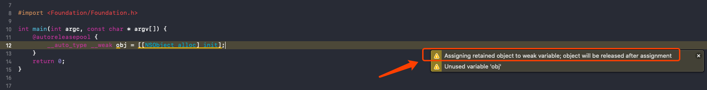

起因：

```
__auto_type __weak wStr = @"123";

__auto_type __weak owStr = [[NSString alloc] initWithString:@"one two three"];
```

发现通过字面量的形式给 __weak 变量赋值，不会出现警告。

我们知道，__weak 在Objc的内存管理里是弱指针，仅指向但不拥有对象，一旦所指向的对象释放了，__weak 变量也会被设置为 nil 。所以常常用于解决循环引用。

根据引用计数的原理，一个对象没有变量去引用了，就会立即被释放掉，而用 __weak 变量去指向一个对象，同样也不会引起该对象引用计数的增加。

实验一下：
```
__auto_type __weak obj = [[NSObject alloc] init];
NSLog(@"%@", obj);

__auto_type objs = [[NSObject alloc] init];
NSLog(@"%@", objs);
```
控制台输出：
```
2020-06-07 07:55:17.812027+0800 debug[2495:33225] (null)
2020-06-07 07:55:17.812886+0800 debug[2495:33225] <NSObject: 0x101004d60>
```

可见 __weak 变量并不能保留对象，在编译器中也会出现编译警告


那么为何什么字面量的形式赋值时，不会出现该警告？难道字面量创建对象不会被释放？

我们将代码编译为C++代码，来分析结构
```
clang --rewrite-objc main.m
```

删去多余代码，我们得到如下主干部分：
```
static __NSConstantStringImpl __NSConstantStringImpl__var_mi_0 __attribute__ ((section ("__DATA, __cfstring"))) = {__CFConstantStringClassReference,0x000007c8,"one two three",13};
static __NSConstantStringImpl __NSConstantStringImpl__var_mi_1 __attribute__ ((section ("__DATA, __cfstring"))) = {__CFConstantStringClassReference,0x000007c8,"one two three",13};

int main(int argc, const char * argv[]) {
    /* @autoreleasepool */ { __AtAutoreleasePool __autoreleasepool; 
        __auto_type wStr = (NSString *)&__NSConstantStringImpl__var_mi_0;
        __auto_type owStr = ((NSString *(*)(id, SEL, NSString * _Nonnull))(void *)objc_msgSend)((id)((NSString *(*)(id, SEL))(void *)objc_msgSend)((id)objc_getClass("NSString"), sel_registerName("alloc")), sel_registerName("initWithString:"), (NSString *)&__NSConstantStringImpl__var_mi_1);
    }
    return 0;
}
```

字面量赋值，其实是将一个静态数据赋值给了 wStr，内存在编译后的二进制中，相当于静态变量。而通过代码结构创建的（有警告的那种），会走消息传递，从而内存交由 ARC 来管理。

出了NSString，NSNumber、NSArray、NSDictionary 也有字面量形式，它们的内存管理是否也和 NSString 一样，是个静态变量？

我们将如下代码，也转化为C++代码：
```
#import <Foundation/Foundation.h>

int main(int argc, const char * argv[]) {
    @autoreleasepool {
        __auto_type str = @"one two three";
        __auto_type str2 = [NSString stringWithString:@"one two three"];
        __auto_type str3 = [[NSString alloc] initWithString:@"one two three"];
        
        __auto_type num = @345;
        
        __auto_type num2 = @1.2345f;
        
        __auto_type dic = @{
            @"dicKey": @"hello world!"
        };
        
        __auto_type arr = @[@"one", @"two", @"three"];
    }
    return 0;
}
```
得到精简后的代码：
```
static __NSConstantStringImpl __NSConstantStringImpl__var_mi_0 __attribute__ ((section ("__DATA, __cfstring"))) = {__CFConstantStringClassReference,0x000007c8,"one two three",13};
static __NSConstantStringImpl __NSConstantStringImpl__var_mi_1 __attribute__ ((section ("__DATA, __cfstring"))) = {__CFConstantStringClassReference,0x000007c8,"one two three",13};
static __NSConstantStringImpl __NSConstantStringImpl__var_mi_2 __attribute__ ((section ("__DATA, __cfstring"))) = {__CFConstantStringClassReference,0x000007c8,"one two three",13};
static __NSConstantStringImpl __NSConstantStringImpl__var_mi_3 __attribute__ ((section ("__DATA, __cfstring"))) = {__CFConstantStringClassReference,0x000007c8,"dicKey",6};
static __NSConstantStringImpl __NSConstantStringImpl__var_mi_4 __attribute__ ((section ("__DATA, __cfstring"))) = {__CFConstantStringClassReference,0x000007c8,"hello world!",12};
static __NSConstantStringImpl __NSConstantStringImpl__var_mi_5 __attribute__ ((section ("__DATA, __cfstring"))) = {__CFConstantStringClassReference,0x000007c8,"one",3};
static __NSConstantStringImpl __NSConstantStringImpl__var_mi_6 __attribute__ ((section ("__DATA, __cfstring"))) = {__CFConstantStringClassReference,0x000007c8,"two",3};
static __NSConstantStringImpl __NSConstantStringImpl__var_mi_7 __attribute__ ((section ("__DATA, __cfstring"))) = {__CFConstantStringClassReference,0x000007c8,"three",5};

int main(int argc, const char * argv[]) {
    /* @autoreleasepool */ { __AtAutoreleasePool __autoreleasepool; 
        __auto_type str = (NSString *)&__NSConstantStringImpl__var_mi_0;
        __auto_type str2 = ((NSString * _Nonnull (*)(id, SEL, NSString * _Nonnull))(void *)objc_msgSend)((id)objc_getClass("NSString"), sel_registerName("stringWithString:"), (NSString *)&__NSConstantStringImpl__var_mi_1);
        __auto_type str3 = ((NSString *(*)(id, SEL, NSString * _Nonnull))(void *)objc_msgSend)((id)((NSString *(*)(id, SEL))(void *)objc_msgSend)((id)objc_getClass("NSString"), sel_registerName("alloc")), sel_registerName("initWithString:"), (NSString *)&__NSConstantStringImpl__var_mi_2);

        __auto_type num = ((NSNumber *(*)(Class, SEL, int))(void *)objc_msgSend)(objc_getClass("NSNumber"), sel_registerName("numberWithInt:"), 345);

        __auto_type num2 = ((NSNumber *(*)(Class, SEL, float))(void *)objc_msgSend)(objc_getClass("NSNumber"), sel_registerName("numberWithFloat:"), 1.23450005F);

        __auto_type dic = ((NSDictionary *(*)(Class, SEL, ObjectType  _Nonnull const *, const id *, NSUInteger))(void *)objc_msgSend)(objc_getClass("NSDictionary"), sel_registerName("dictionaryWithObjects:forKeys:count:"), (const id *)__NSContainer_literal(1U, (NSString *)&__NSConstantStringImpl__var_mi_4).arr, (const id *)__NSContainer_literal(1U, (NSString *)&__NSConstantStringImpl__var_mi_3).arr, 1U);

        __auto_type arr = ((NSArray *(*)(Class, SEL, ObjectType  _Nonnull const * _Nonnull, NSUInteger))(void *)objc_msgSend)(objc_getClass("NSArray"), sel_registerName("arrayWithObjects:count:"), (const id *)__NSContainer_literal(3U, (NSString *)&__NSConstantStringImpl__var_mi_5, (NSString *)&__NSConstantStringImpl__var_mi_6, (NSString *)&__NSConstantStringImpl__var_mi_6).arr, 3U);
    }
    return 0;
}
```

我们发现出了 NSString ，其他字面量并不是静态变量，而是间接的调用了自己的构造方法。

总结一下字面量的内存管理：
NSString     -> 静态变量
NSNumber     -> ARC
NSDictionary -> ARC
NSArray      -> ARC

参考：https://stackoverflow.com/questions/48416192/assigning-object-to-weak-reference-in-objective-c