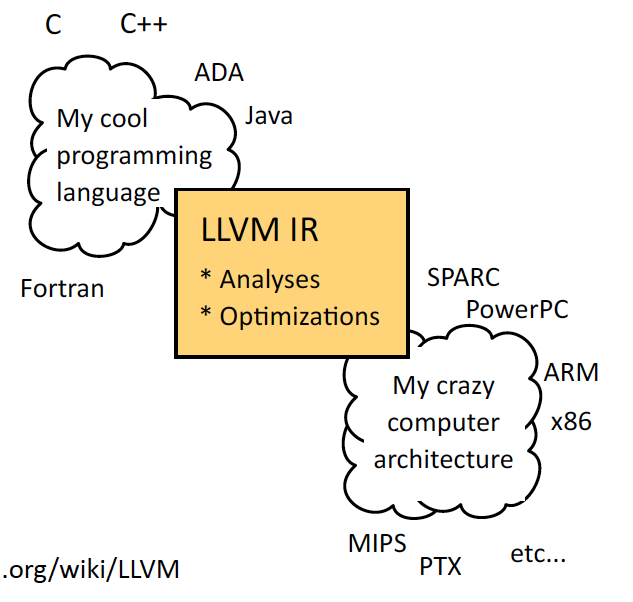
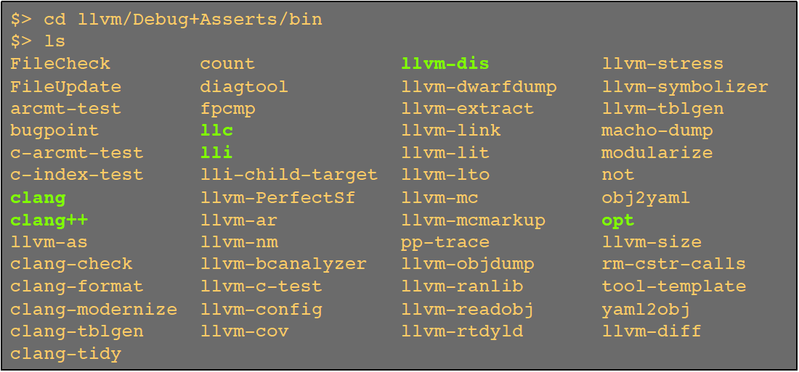

### 简介

LLVM 是一个发展中的前言编辑器技术框架，它易于扩展并设计成多个库的形式，可以为编译器开发者提供流畅的体验，并能使编译器开发所涉及的学习过程变得非常流畅。

#### LLVM 架构特性

1. C++ 语言实现
2. 前端与后端分离，支持多种前端和后端，使用中间代码 IR 进行衔接



3. 第一个 Release 版本发布于 2003 年，代码开源
4. 提供了很多工具用于编译和优化代码



5. 与 GCC 相比，编译出的程序运行效率更高

### Tools 使用

LLVM 的一些优化和绘图都针对 bitcode 文件，这里介绍与之相关的工具使用

从 源文件 生成 bitcode 文件
```
clang -c -emit-llvm const.c -o const.bc
```
clang 是 LLVM 的前端编译工具，可以用它来生成目标文件，这个指令将 .c 代码生成 .bc 文件.

warning:
使用这个命令的时候会自动带有 -O0 级别的优化（新版本中），可以禁止它，[参考](https://stackoverflow.com/questions/46513801/llvm-opt-mem2reg-has-no-effect?noredirect=1)
```
clang -c -emit-llvm -Xclang -disable-O0-optnone const.c -o const.bc    
```

llvm tools 提供了产生 cfg callgraph 等图片参数的工具（opt），注意，不会自己生成图片，还需要工具（如：graphviz MacOS下安装 brew install graphviz）
cfg 图
```
opt –view-cfg const.bc
```
call 图
```
opt -view-callgraph file.bc
```

中间代码优化
用 opt ，还可以调用 LLVM 提供的优化器对 bitcode 文件进行代码优化
```
opt -mem2reg const.bc -o const.reg.bc
```
-constprop  临时变量
-early-cse  消除公共部分
运行 help ，可以查看 LLVM 提供的优化器
```
opt -help
```
-load 可以加载自定义的优化器（或其他分析器），如
```
opt -load LLVMCountOp.dylib -opCounter file.bc -o file.oc.bc
opt -load LLVMCountOp.dylib -help
```
-opCounter      LLVMCountOp.dylib 里面 Pass 的注册标记

如果仅仅分析代码，可以用 -disable-output 禁用输出
```
opt -load LLVMCountOp.dylib -opCounter -disable-output -time-passes file.bc
```
-time-passes    pass 运行时间

bitcode 文件生产 .ll ,中间代码 IR 文件
```
llvm-dis const.bc  
```
可以对 .ll 进行即时运行（JIT）
```
lli const.ll   
```

bitcode 文件生成可执行文件
```
clang const.ll
./a.out
```

bitcode 文件生成目标平台机器码
```
llc -march=x86 ex0.reg.bc -o ex0.reg.x86
```

### 使用官方二进制库
LLVM 官网提供了各个版本的下载，有二进制文件和源码，使用二进制文件中包含了可以直接运行在目标平台的 Tools 和 LLVM 的基础功能静态库。
直接使用二进制静态库，可以开发出我们自己的编译工具，Tools 里有 llvm-config 提供了补充 LLVM 各个依赖参数功能，可以方便编写 MakeFile 文件，编译工程。
[仓库](https://github.com/AirChen/llvm-play)下 JIT 提供了一个编译工具的工程，依赖的 LLVM 版本是 3.4 。提供了一个通用的 MakeFile 模板。


LLVM_CONFIG ?= ../bin_3.4/bin/llvm-config

ifndef VERBOSE
QUIET := @
endif

SRC_DIR ?= $(PWD)

LLVM_LDFLAGS := $(shell $(LLVM_CONFIG) --ldflags)
COMMON_FLAGS = -Wall -Wextra
LLVM_CXXFLAGS += $(COMMON_FLAGS) $(shell $(LLVM_CONFIG) --cxxflags)
LLVM_CPPFLAGS += $(shell $(LLVM_CONFIG) --cppflags) -I$(SRC_DIR)
LLVM_LIBS = $(shell $(LLVM_CONFIG) --libs jit interpreter nativecodegen)

objects = Driver.o Expr.o Lexer.o Parser.o
name = driver

default: $(name)

$(name) : $(objects)
		@echo Linking $@
		$(QUIET)$(CXX) -o $@ $(LLVM_CXXFLAGS) $(LLVM_LDFLAGS) $^ $(LLVM_LIBS)

%.o : %.cpp
		@echo Compiling $*.cpp
		$(QUIET)$(CXX) -c $< $(LLVM_CPPFLAGS) -o $@

clean::
		$(QUIET)rm -f $(name) $(objects)

系统下配置好 clang 环境，然后设置好 LLVM_CONFIG 目录，即可运行 make 命令，进行编译。

### 使用官方源码
借助于官网提供的源代码也能开发出高效工具，这里以 Pass 的开发为例。
从官网找到一个版本（如:3.4）的代码后，下载到本地，代码工程由 cmake 工具组织，可以在工程下创建目录llvm_xcode，然后进入目录执行
```
cmake -G Xcode ../llvm 
```
就能生成支持 Xcode 的项目，用 Xcode IDE 可以打开工程（还支持其他IDE工具，详情参考[官网](http://llvm.org/docs/GettingStarted.html)）。
在源码工程下我们可以找到一个实例工程 Hello ，这是一个 Pass 工程，在 llvm/lib/Transforms 目录下（不是 llvm_xcode 下的 lib）。我们使用目录工具进入该文件下，模仿Hello工程的配置，新建自己的工程，修改 Transforms 目录下的 CMakeList.txt Makefile 和 子目录下的文件。然后回到 llvm_xcode 目录下，再执行一遍 cmake 指令。
Xcode IDE 可以对工程代码进行编辑，编译完成后，可以对目标 Target 进行编译。会生成以动态链接库，放在工程下验证， [仓库](https://github.com/AirChen/llvm-play) Passes 下提供了编译好的库，可以直接使用。

#### 常见错误：


Error opening 'LLVMCountOp.dylib': dlopen(LLVMCountOp.dylib, 9): Symbol not found: __ZN4llvm12FunctionPass17assignPassManagerERNS_7PMStackENS_15PassManagerTypeE
  Referenced from: LLVMCountOp.dylib
  Expected in: flat namespace


加载的 Pass 和 opt 版本不对，或者 Release Debug 不一致

### 参考

[Makefile 调用 llvm-config](https://blog.csdn.net/snsn1984/article/details/41477351)

[llvm-config 官文](https://releases.llvm.org/2.7/docs/CommandGuide/html/llvm-config.html)

[Makefile 官文](http://www.gnu.org/software/make/manual/make.html#Introduction)

[课件官网](https://homepages.dcc.ufmg.br/~fernando/classes/dcc888/ementa/)