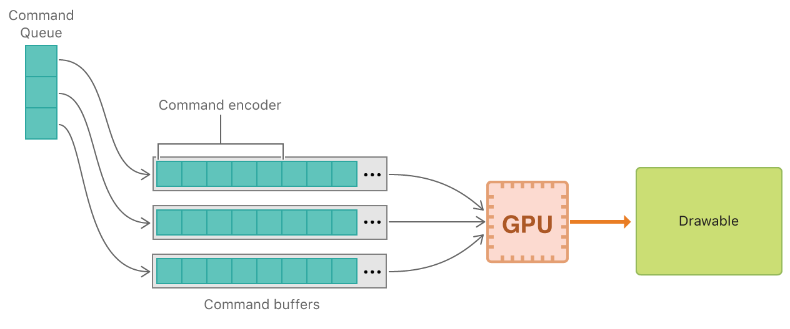
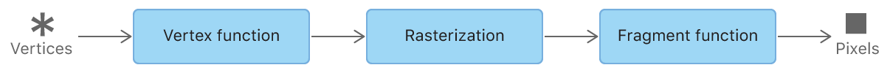
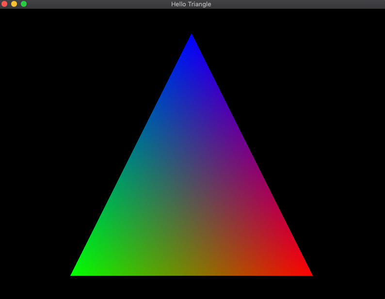

### 简介

Metal 提供了和 GPU 的底层交互，让开发者可以使自己的iOS、macOS、tvOS应用表现出最佳的图形和运算处理性能。该文章从苹果官方提供的机组 demo 入手，介绍 MetalKit 和  Metal Shading Language 的使用，并使用它们进行图形渲染和科学计算。

### MetalKit使用的基本步骤

第一个最重要的类是 MTKView ,这是一个包裹了 UIView 或者 NSView 的对象，具备 Metal-spcific 的核心动画功能，渲染的内容在 MTKView 上进行显示。MTKView 比较重要的属性是 preferredFramesPerSecond 、device 和 delegate 。

preferredFramesPerSecond 毋庸置疑是用来设置帧率的，这个帧率不是绝对的，会受限与设备的最大帧率和最小帧率，当这个值大于最大帧率，则选择最大帧率；小于最小帧率，则选择最小帧率。其默认值为 60 。

device 用来获取 Metal 与 GPU 交互的一系列对象，默认值是 nil ，需要使用 MTLCreateSystemDefaultDevice() 来主动获取。

delegate 具备了 MTKViewDelegate ，其提供 mtkView:drawableSizeWillChange: 和 drawInMTKView: 回调。每刷新一帧 drawInMTKView: 回调会被调用一次，在 drawInMTKView: 里面可以进行绘制或者计算相关的工作；mtkView:drawableSizeWillChange: 回调是在 MTKView 的 frame 发生改变的时候回调，可以手机发生屏幕旋转或者其他需要调整视图的操作时，调整绘制区域。

第二类是 Metal 与 GPU 交互相关的对象
如图是一个绘制的基本流程：

我们需要一个具备 MTLCommandQueue 协议的对象，其负责在每一帧里生产一系列具备 MTLCommandBuffer 协议的对象，Metal 与 GPU 的交互都会被写入到这些具备 MTLCommandBuffer 协议的对象里面，而这个写入的过程需要通过一个具备 MTLXXXCommandEncoder（MTLRenderCommandEncoder、MTLComputeCommandEncoder 或者其他的Encoder）协议的对象。

以下是一个绘制的基本结构：


- (void)prepare {
	_device = MTLCreateSystemDefaultDevice();
	_commandQueue = [_device newCommandQueue];
}

- (void)drawInMTKView:(nonnull MTKView *)view
{
	// 设置背景颜色
    Color color = [self makeFancyColor];
    view.clearColor = MTLClearColorMake(color.red, color.green, color.blue, color.alpha);

    id<MTLCommandBuffer> commandBuffer = [_commandQueue commandBuffer];
    commandBuffer.label = @"MyCommand";

    MTLRenderPassDescriptor *renderPassDescriptor = view.currentRenderPassDescriptor;
    if(renderPassDescriptor != nil)
    {
        id<MTLRenderCommandEncoder> renderEncoder = [commandBuffer renderCommandEncoderWithDescriptor:renderPassDescriptor];

        renderEncoder.label = @"MyRenderEncoder";

    /*
        这里写入绘制相关
    */

        [renderEncoder endEncoding];

        [commandBuffer presentDrawable:view.currentDrawable];
    }

    // Finalize rendering here and submit the command buffer to the GPU
    [commandBuffer commit];
}


并行计算的 MTLComputeCommandEncoder 对象不需要借助 MTLRenderPassDescriptor 来创建，其结构为：


- (void)prepare {
	_device = MTLCreateSystemDefaultDevice();
	_commandQueue = [_device newCommandQueue];
}

- (void)drawInMTKView:(nonnull MTKView *)view
{
    id<MTLCommandBuffer> commandBuffer = [_commandQueue commandBuffer];
    commandBuffer.label = @"MyCommand";

    id<MTLComputeCommandEncoder> computeEncoder = [commandBuffer computeCommandEncoder];

    /*
    并行计算相关
    */   

    [computeEncoder endEncoding];
    
    /*
    	有其他的 Encoder 可以继续叠加
    */

    // Finalize rendering here and submit the command buffer to the GPU
    [commandBuffer commit];
}


### 绘制一个三角形

绘制管线是 GPU 处理图像渲染的一步步流程，如图所示：

Metal 的绘制管线包含了 Vertex function 、Rasterization、Fragment function 三个阶段，Vertex function 阶段接受顶点数据（这里的顶点数据包括了顶点的位置和颜色信息），负责将顶点数据绘制到一个 2D 的可视区域；Rasterization 接受从 Vertex function 传过来的顶点数据，决定哪些数据是要绘制在什么地方的；Fragment function 将颜色值赋值到像素（后期如果有纹理，也在这里操作），最后输出绘制后的图像。创建一个绘制管线的步骤如下：


MTLRenderPipelineDescriptor *pipelineStateDescriptor = [[MTLRenderPipelineDescriptor alloc] init];
pipelineStateDescriptor.label = @"Simple Pipeline";
pipelineStateDescriptor.vertexFunction = vertexFunction; // 设置 Vertex function
pipelineStateDescriptor.fragmentFunction = fragmentFunction; // 设置 Fragment function
pipelineStateDescriptor.colorAttachments[0].pixelFormat = mtkView.colorPixelFormat; // 像素颜色格式
    
// 使用的时候将 _pipelineState 赋值给 Encoder
_pipelineState = [_device newRenderPipelineStateWithDescriptor:pipelineStateDescriptor
                                                            error:&error];
                                                                


其中 Vertex function 和 Fragment function 分别在顶点着色器和片段着色器中实现，需要使用 Metal Shading Language 来编写，Rasterization 阶段不提供编程化的接口。

Metal Shading Language 的语法和 C++ 14 很像，区别在于 C++ 14 是 CPU 上运行的语言，Metal Shading Language 运行在 GPU 上，GPU 提供更大并行处理能力，对有大量数据需要处理的 Vertex function 和 Fragment function 会大大的提高效率。编写的着色器函数保存为 .metal 文件，其编译分为两个阶段：

    1. Front-end 阶段发生在 XCode build 时，.metal 文件会被编译为 IR 文件。
    2. Back-end 阶段发生在 runtime ，IR 文件会被编译为机器码。

加载 IR 文件的过程通过 device 的 newDefaultLibrary 方法，得到一个具备 MTLLibrary 协议的对象。取出里面的 Vertex function 和 Fragment function 通过 MTLLibrary 对象的 newFunctionWithName 方法。


id<MTLLibrary> defaultLibrary = [_device newDefaultLibrary];

id<MTLFunction> vertexFunction = [defaultLibrary newFunctionWithName:@"vertexShader"]; // 得到 Vertex function
id<MTLFunction> fragmentFunction = [defaultLibrary newFunctionWithName:@"fragmentShader"]; // 得到 Fragment function


绘制使用的数据类型涉及 SIMD 和一个具备 MTLBuffer 协议的对象，SIMD 是一个独立于 Metal 的库，能简化算法和 GPU 处理流程，效率高使用十分方便，常在 Metal 应用中使用。MTLBuffer 是 Metal 提供的用来保存大量顶点数据的 buffer ，其内存由 GPU 可访问的内存分配，效率高，可以节省内存的占用（当顶点数据量庞大的时候）。使用的时候一般自定义一个顶点数据结构，包含坐标点和颜色信息，这个数据结构的定义会用到 SIMD 里面的类型：


typedef struct
{
    vector_float2 position;// 一个二维的位置矢量

    vector_float4 color;// 一个四维的颜色矢量
} AAPLVertex;


将定义好的 APPLVertex 数组传入 MTLBuffer 对象可以通过：


// Set up a simple MTLBuffer with our vertices which include texture coordinates
static const AAPLVertex quadVertices[] =
{
    // Pixel positions, Texture coordinates
    { {  250,  -250 },  { 1.f, 0.f } },
    { { -250,  -250 },  { 0.f, 0.f } },
    { { -250,   250 },  { 0.f, 1.f } },

    { {  250,  -250 },  { 1.f, 0.f } },
    { { -250,   250 },  { 0.f, 1.f } },
    { {  250,   250 },  { 1.f, 1.f } },
};

// Create our vertex buffer, and initialize it with our quadVertices array
_vertices = [_device newBufferWithBytes:quadVertices
                                    length:sizeof(quadVertices)
                                options:MTLResourceStorageModeShared];


之后使用 Encoder 的 setVertexBuffer: 方法可将 MTLBuffer 对象传给顶点着色器（Vertex function），运行绘制管线。

最终的绘制的三角形如图：

#### 参考
[Metal 文档](https://developer.apple.com/documentation/metal)