### 机器学习的两种定义：

1. 来自Arthur Samuel 的表述: "the field of study that gives computers the ability to learn without being explicitly programmed."这是一种古老的非正式的定义。
2. Tom Mitchell 提供的一种现代化的定义: "A computer program is said to learn from experience E with respect to some class of tasks T and performance measure P, if its performance at tasks in T, as measured by P, improves with experience E."

举个例子，跳棋游戏

E = 玩跳棋的经验

T = 下跳棋的过程

P = 下场跳棋获胜的可能性

### 机器学习分为监督学习和非监督学习:

监督学习是指给出数据集合和单个数据子集对应的输出结果，认为这些数据集和输出结果之间存在某种关系。
监督学习可以分为回归和分类，回归对应输出的结果可以拟合连续性的，分类对应的输出结果对应是离散的。举个例子，给出一个男性或者女性的照片，预测照片上人物的年龄，因为输出结果是一系列连续的预测，所以这属于回归问题；如果通过这个照片来预测照片上人物的年龄是属于哪个学龄阶段(高中、大学、研究生)，由于结果都是一段一段分离的时间，所以认为这是一种分类问题。

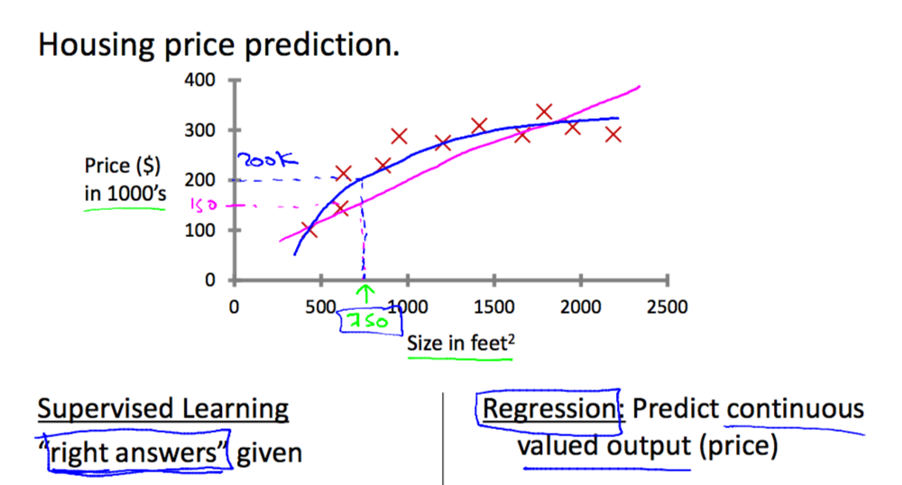
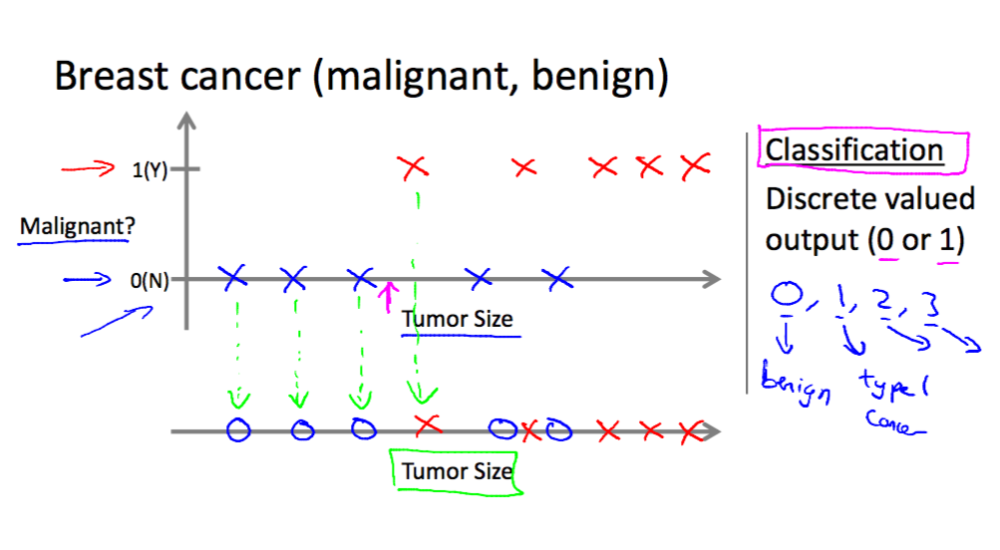

非监督学习，从另一方面出发，我们并不知道从给出的数据中，可以得到什么样的结果。学习结果最终会得到一个数据的分析结果，当然我们也不必数据中每个量参与决策的作用。
类聚算法，给出1000篇左右的博客文章，通过对文章中词汇的出现频率、句子长短、文章的篇幅等信息，将1000篇文章归为许多类。
[鸡尾酒会算法](https://en.wikipedia.org/wiki/Cocktail_party_effect)

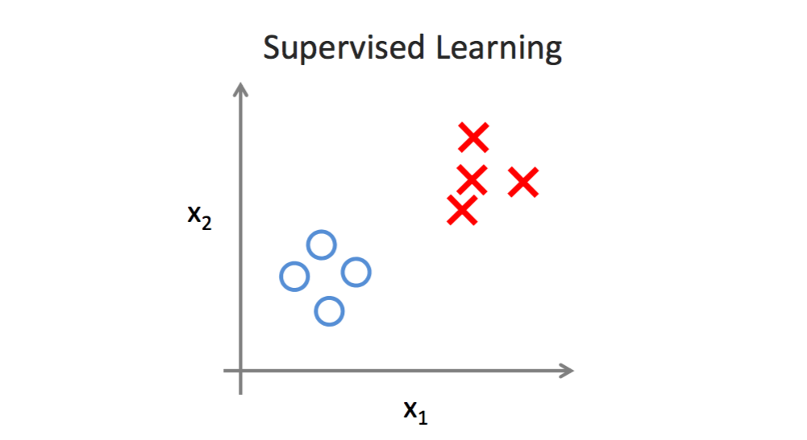
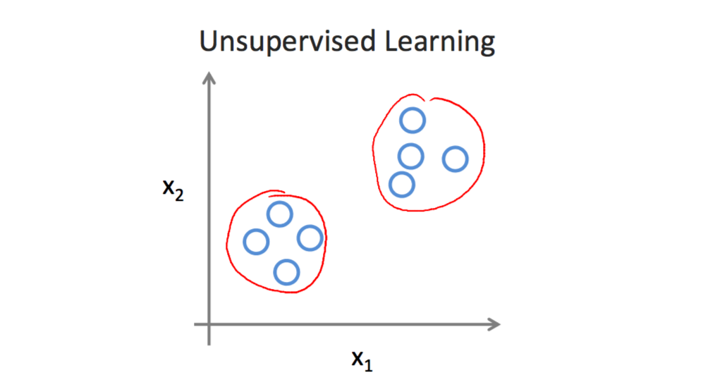

### 单变量线性回归

一种通过单一变量进行预测的监督式学习模型，命特性量为x，结果为y，我们的假设x和y之间存在下面等式中的关系：

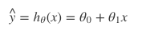

这个等式即假设函数，假设函数可以用来做预测，使用实际中的数据预测结果。但预测结果不一定准确，我们希望找到最合适的θ0和θ1，来表述这个等式，使假设函数的实际预测能力最好。通过代价函数，我们可以来判断假设函数的准确性，命代价函数如下：

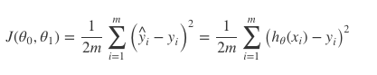

m即数据集大小，给定的已知数据集有多大，这个值就为多少。我们用代价函数来计算θ0和θ1的值，代价函数的值越小代表假设函数的模拟效果越好，预测能力约准确。
`验证`将假设函数简化一下，保留一个参数θ1，得到下面式子：

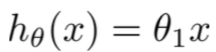

通过给参数θ1赋予不同的值可以得到代价函数和假设函数之间的关系：

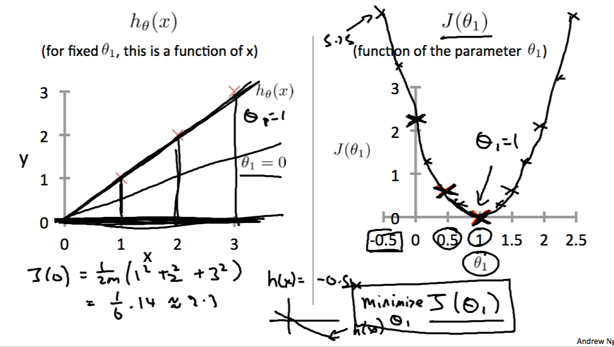

`当代价函数的值最小时，假设函数的模拟效果最好。`同时类比一下，将θ0也带入，可以知道，通过参数θ0和θ1，可以共同决定代价函数的取值，这时的任务就是找出代价函数的最小值。

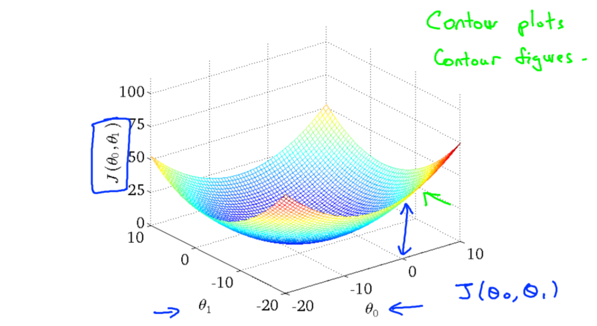

坡度下降法是求解代价函数最小值的一种有效方法，算法的总体思想是想在代价函数的映射关系图中，找出一条通往最小值点的最快路径：

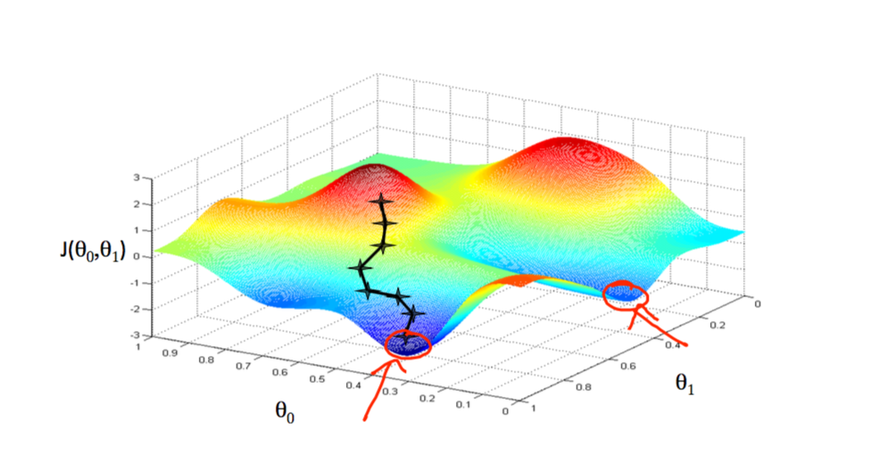

图中出现两个极小值点，这说明梯度下降算法只能够求出局部极值点，不一定是全局的，取不同的初始值结果可能不同。但由于代价函数的图形总是出现为弧形结构，所以局部极小值往往都是全局的极小值。
其迭代式如下：

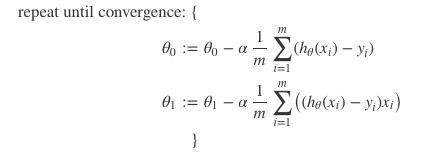

### 多元线性回归

将特征量由原来的单一量x变为一个X向量，多元线性回归就是找出多个特征量和结果y之间的线性关系。
类比单变量线性回归，假设函数、代价函数和梯度下降算法的迭代变成了如下形式：

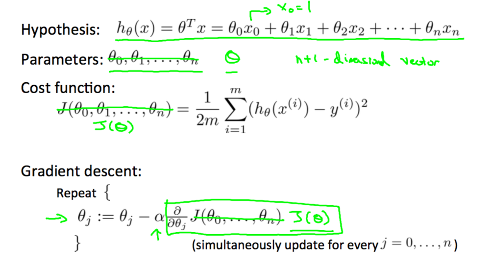
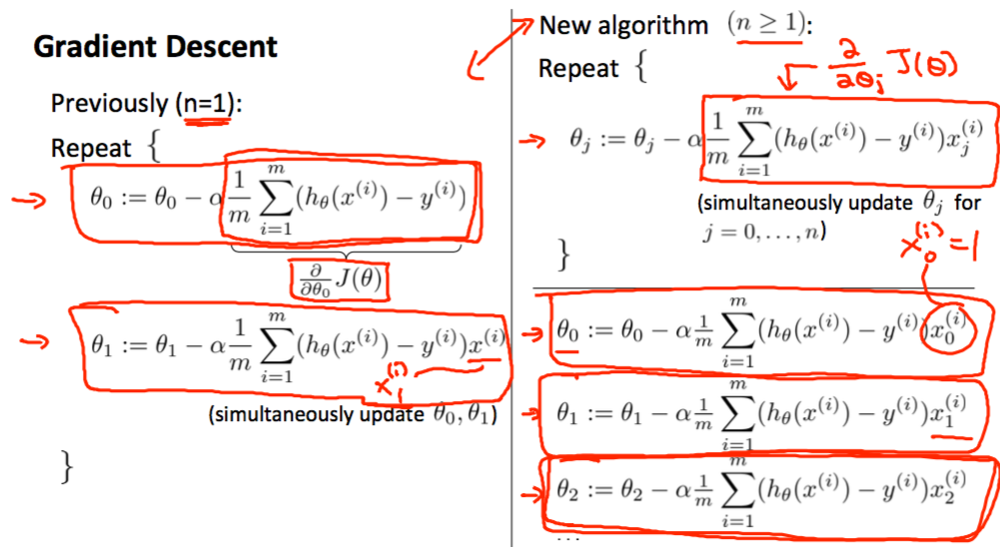

其中$$x_j^(i)$$特征量的右下角数字代表着一系列特征量中的某一个，右上角括号中的数字代表着第几个测试组。

### 梯度下降算法的使用经验

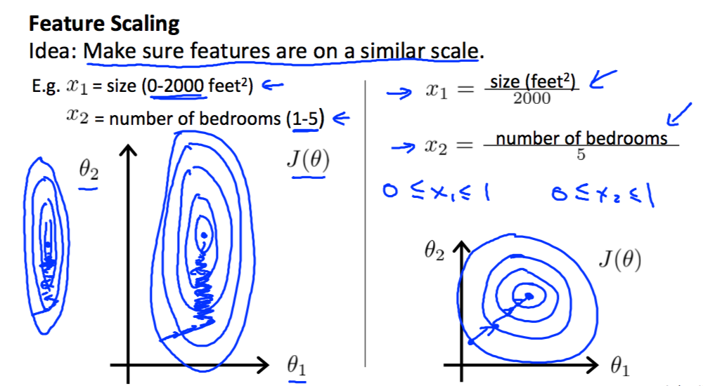

如图，特征量在各自的取值范围相差不大的时候，梯度下降算法的下降速度更快，所以在考虑使用梯度下降来求解代价函数的极值时，可以先对特征量进行归一化，归一化的公式如下：

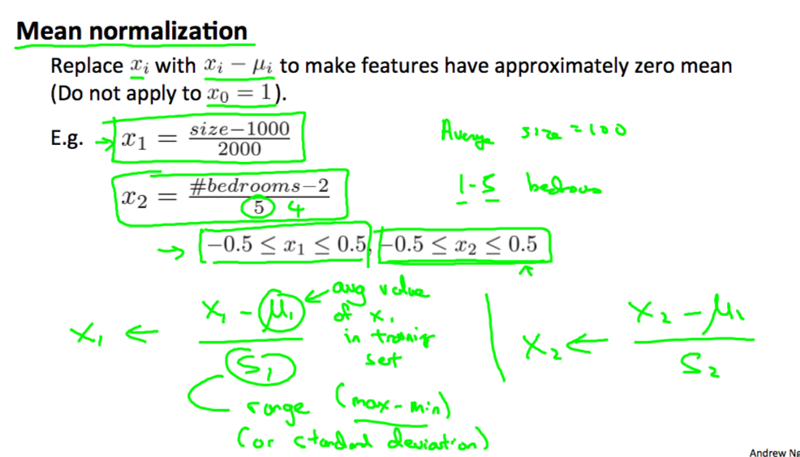

用特征值减去特征值得均值，之后再用其结果去除以特征值的取值范围(最大值减去最小值),这样可以大致将特征值得范围限制在-0.5到0.5的范围内。将每个特征值都做类似处理之后，使用梯度下降时，迭代次数会大大减少。

关于迭代系数`α`的取值,如果取值太大，会出现迭代的时候代价函数的值出现增长的情况，或者是开始是下降，下降一定次数之后出现增长的情况，这个时候应该将`α`的值取得小一些，但太小也不行，会造成迭代的此次过多，影响效率。
为此，可以从一个较小的值开始取，当代价函数的值小于我们设定的下降阈值，我们再降`α`值增加十倍，然后再迭代，出现增长再减小`α`值，直到代价函数的值不怎么变动时，停止迭代。

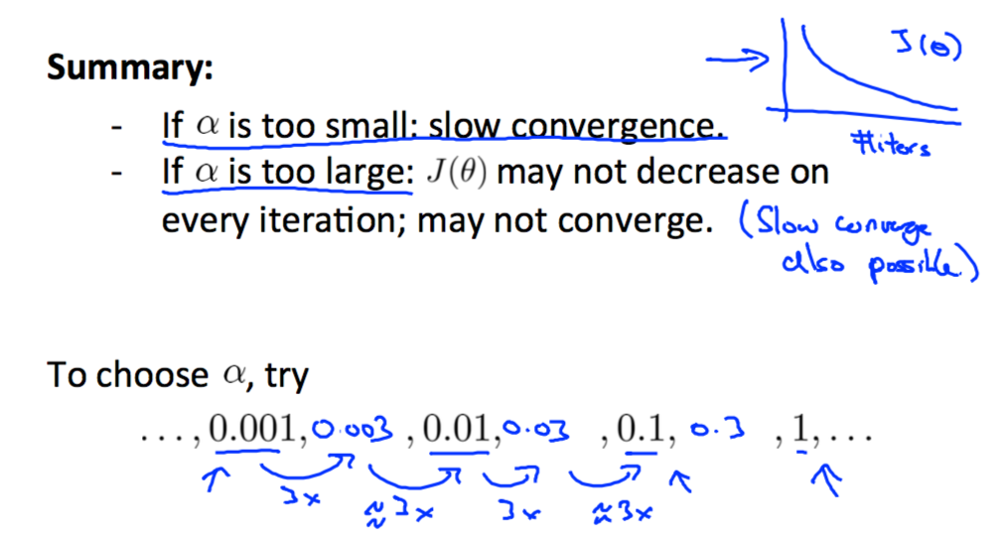

有时候，特征值的种类不是很多，为了达到更好的拟合效果，可以通过给特征量取次方的形式。

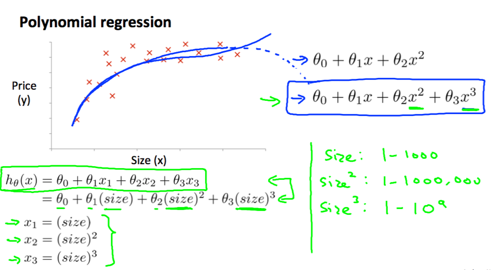

### 求解代价函数极值的另一种方法
类似与求解函数的极值，高数中用先求解方程的导数，再命其值为零的方法进行求解。这里也可以用类似的方法，将代价函数进行求偏导数处理，最后将得到的结果用矩阵的形式表述出来如下：

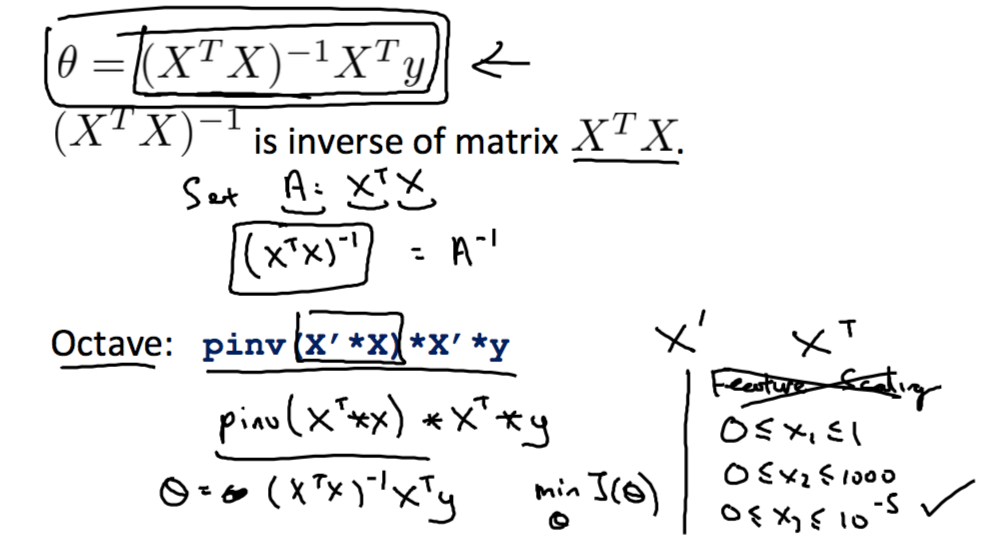

这种方法叫做正态方程求解，在特征值较少的时候，执行效率高于梯度下降算法，二者的比较如下：

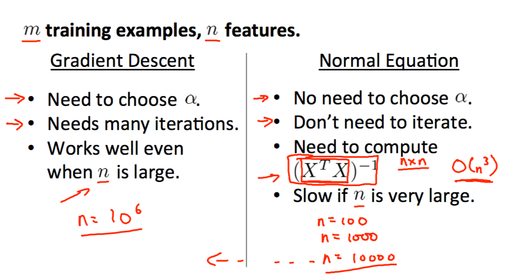

它不需要选择`α`值，不用进行迭代，但需要进行矩阵运算，算法的复杂度为$$o(n^3)$$。
学过线性代数的同学都会知道，$$X^T*X$$的值有可能不是可逆矩阵，这个时候，正态方程的方法就貌似不可用了，这里有两个办法可以解决这个问题：

1. 特征量之间可能有多余的，明显特征是两个特征量之间存在线性关系，如果发现这类特征量，删除其中任一一个量即可。
2. 特征量太多，而实际的数据量样本太少，即m的取值可能是10，但n的取值为100+，这个时候，可以考虑去掉一些并不是那么重要的特征量。

参考资料

[Coursera课程](https://www.coursera.org/learn/machine-learning/home/welcome)

[梯度下降算法的原理讲解视频]([https://www.youtube.com/watch?v=WnqQrPNYz5Q](https://www.youtube.com/watch?v=WnqQrPNYz5Q))
