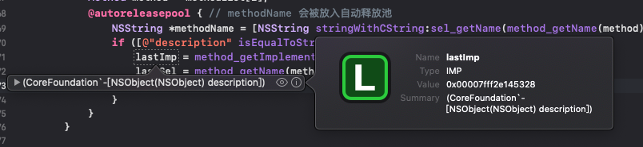
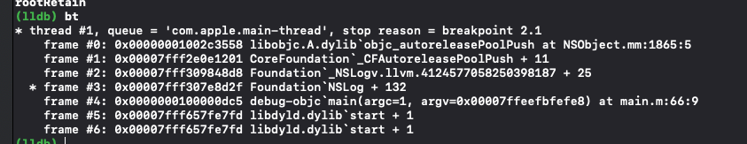
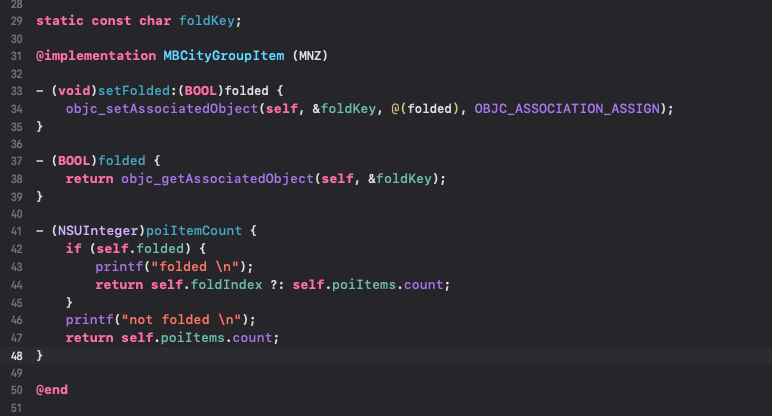

运行时的继续研究  + 笔记中的上半部分

```
@interface TObject : NSObject
+ (instancetype)getT;
@end

@implementation TObject

+ (instancetype)getT {
    return [TObject new];
}

+ (NSArray *)array {
    return [NSArray new];
}

+ (NSNumber *)number {
    return [NSNumber new];
}

+ (NSPredicate *)p {
    return [NSPredicate new];
}

@end

int main(int argc, const char * argv[]) {
    @autoreleasepool {        
        _objc_autoreleasePoolPrint();

        __auto_type obj = [TObject getT]; // autorelease
        _objc_autoreleasePoolPrint();
        
        __auto_type predicate = [TObject p]; // autorelease
        _objc_autoreleasePoolPrint();
        
        __auto_type arr = [TObject array]; // LTS
        _objc_autoreleasePoolPrint();
        
        __auto_type num = [TObject number]; // LTS
        _objc_autoreleasePoolPrint();
        
    }
    _objc_autoreleasePoolPrint();
    
    return 0;
}
```

测试返回值的内存管理  有些事放在 autorelease里，有些事在 LTS 里

```
NSObject *obj = [NSObject new];
        
__auto_type __weak weakO = obj;

unsigned int methodCount;
Method *methodList = class_copyMethodList([NSObject class], &methodCount);
IMP lastImp = NULL;
SEL lastSel = NULL;
        
typedef NSString* (*fn)(id,SEL);

for (NSInteger i = 0; i < methodCount; i++) {
    Method method = methodList[i];
    @autoreleasepool { // methodName 会被放入自动释放池
        NSString *methodName = [NSString stringWithCString:sel_getName(method_getName(method)) encoding:NSUTF8StringEncoding];
        if ([@"description" isEqualToString:methodName]) {
            lastImp = method_getImplementation(method);
            lastSel = method_getName(method);
//                    break;
        }
    }
}

fn f = (fn)lastImp;
for (int i = 0; i < 10; i++) {
    NSString *des = f(weakO, lastSel);
    if (des) {
        NSLog(@"---> %@", des);
    } else {
        NSLog(@"---> in NSObject");
    }
}
        
free(methodList);

_objc_autoreleasePoolPrint();
```
测试 NSObject 的 description 方法 ，内存自动释放 貌似是CoreFoundation 中的实现会用自动释放池




由此可见 NSLog 中有 自己的自动释放池

https://www.jianshu.com/p/9597ca7439ea  关于 __weak 对象的引用，NSLog 中可能加入了 自动释放池

```
__auto_type __weak wStr = @"123";// signton

__auto_type __weak owStr = [NSString stringWithString:@"123"];
```
一个有警告，一个没有警告
字面量语法 => NSNumber NSString NSArray NSDictionary
https://stackoverflow.com/questions/48416192/assigning-object-to-weak-reference-in-objective-c

NSString被存在于可执行文件中，不会被销毁，单例对象 singleton object

https://draveness.me/autoreleasepool/  关于自动释放池


数据类型 id ，此处返回 BOOl 类型永远为 YES ，它指向了一个地址


Tagged Pointer 的函数返回值放入 TLS，其他对象放 autorelease

https://www.infoq.cn/article/deep-understanding-of-tagged-pointer
苹果将Tagged Pointer引入，给 64 位系统带来了内存的节省和运行效率的提高。Tagged Pointer通过在其最后一个 bit 位设置一个特殊标记，用于将数据直接保存在指针本身中。因为Tagged Pointer并不是真正的对象，我们在使用时需要注意不要直接访问其 isa 变量。

