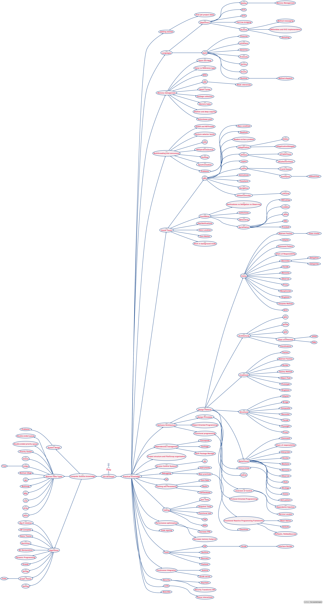

有很长一段时间没有更新自己的blog了，期间有春节假期、春节假期之前的忙、春节假期之后的懒，不得不承认自己是个不折不扣的懒癌晚期患者😂。其实年后，在工作上的任务也有所调整的，之前有很长一段时间是做iOS SDK的封装，及底层移植层的开发，年后不久组老大启动了我们团队自己的APP开发计划（我们团队是负责GIS地图引擎开发团队）。我也着手开始开发APP，期间组内招了一个iOS小伙伴，这个APP的iOS端也就由我们两人负责开发。

在开发过程中，我也在不断的梳理自己在iOS开发方面的技术点，并打算定期更新自己的博客，与读者一起分享在这APP开发过程中的一些坑。

### List

#### `UILabel`的自动换行：

```
_addressLabel.numberOfLines = 0;
_addressLabel.lineBreakMode = NSLineBreakByWordWrapping;

```
计算字符串高度:

```
UILabel 方法
- (CGSize)systemLayoutSizeFittingSize:(CGSize)targetSize;
UIView 方法
- (CGSize)sizeThatFits:(CGSize)size;
NSString 方法
- (CGRect)boundingRectWithSize:(CGSize)size options:(NSStringDrawingOptions)options attributes:(NSDictionary<NSString *,id> *)attributes context:(NSStringDrawingContext *)context;
```

#### `UITableView`顶格，去掉最上面一行的间隔

```
self.tableView.tableHeaderView = [[UIView alloc] initWithFrame:CGRectMake(0, 0, 0, CGFLOAT_MIN)];
```

#### XCode9 使用rename的时候，出现 'rename failed' 情况时

1.关闭XCode

2.进入文件夹 ~/Library/Developer/Xcode/DerivedData/，删除文件夹下的所有文件

3.启动XCode

或者可以直接用终端输入：

```
rm -rf ~/Library/Developer/Xcode/DerivedData/*
```
XCode重启即可

#### `UICollectionView`数据不够时，不能竖向滑动
`UICollectionView` 的属性bounces 默认的水平方向的滑动设置，其实还有alwaysBounceVertical 和alwaysBounceHorizontal属性，alwaysBounceHorizontal 和bounces 的效果一致，如果是竖向可以使用alwaysBounceVertical属性

`UICollectionView`在一个frame 动画之后，调用setContentOffset 没有作用，不能改变里面内容的位置，这个时候，应该把setContentOffset 方法也放入一个动画中去调用。

#### `NSTimer`的循环圈
调用`NSTimer` 的scheduledTimerWithTimeInterval: target: selector: userInfo: repeats: 来初始化一个NSTimer对象时，有可能会产生循环引用。可以使用scheduledTimerWithTimeInterval:repeats:block: 方法。

最后附上一个比较全的iOS 技能图谱



### 参考
[计算字符串高度](http://nextcocoa.com/uilabel-gen-ju-nei-rong-ji-suan-gao-du-de-san-chong-fang-fa/)

[UITableView 顶格](https://blog.sunnyxx.com/2015/04/15/ios-hide-grouped-tableview-header/)

[UICollectionView does not scroll](https://stackoverflow.com/questions/16069357/uicollectionview-does-not-scroll)

[uitableview 在动画后自动滑动到顶端](https://github.com/caoimghgin/TableViewCellWithAutoLayout/issues/13/tour/getting-started/)
